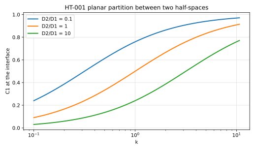
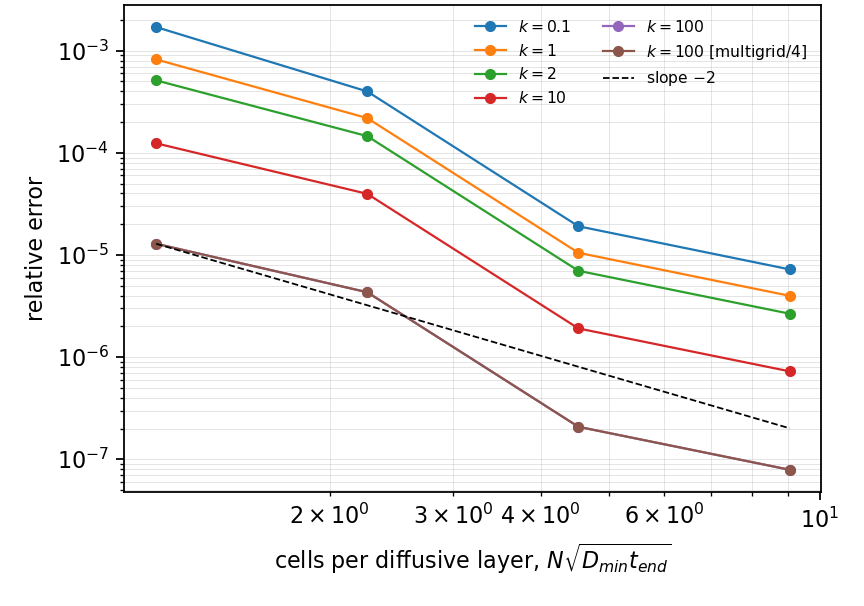
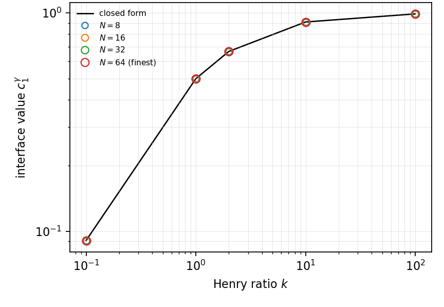
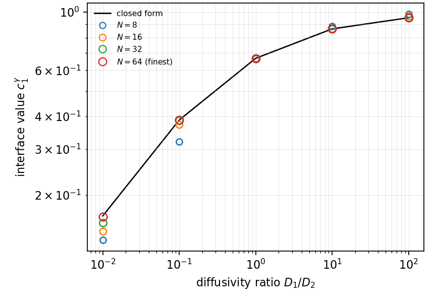

# HT-001 - Planar partition between two half-spaces

## Problem

Phase 1 occupies $x<0$ with diffusivity $D_1$ and initial value $1$; phase 2
occupies $x>0$ with diffusivity $D_2$ and initial value $0$. The same equations
describe conjugate heat transfer with $D$ a thermal diffusivity and $k$ the
ratio of the equilibrium values.

$$
\partial_t C_i = D_i \partial_x^2 C_i, \qquad i = 1, 2 .
$$

At $x=0$,

$$
C_1 = k\, C_2, \qquad
D_1 \partial_x C_1 = D_2 \partial_x C_2 ,
$$

with $C_1(x,0)=1$ for $x<0$ and $C_2(x,0)=0$ for $x>0$.

## Parameters

| Parameter | Symbol |
|---|---|
| diffusivity, phase 1 | $D_1$ |
| diffusivity, phase 2 | $D_2$ |
| partition coefficient | $k$ |

## Reference

The interfacial values are constant in time,

$$
C_1^s = \frac{k\sqrt{D_1}}{\sqrt{D_2} + k\sqrt{D_1}},
\qquad
C_2^s = \frac{\sqrt{D_1}}{\sqrt{D_2} + k\sqrt{D_1}},
$$

and the profiles are complementary error functions on each side. At equal
diffusivities these reduce to the familiar pair $k/(1+k)$ and $1/(1+k)$; that
reduced form is wrong by $\sqrt{D_1/D_2}$ otherwise, which is the trap this
case exists to catch.

## Report

- $C_1^s$ and $C_2^s$ against the closed form,
- the residual of $C_1 - kC_2$ at the interface, which should reach machine
  precision,
- profiles on both sides,
- observed convergence rate.

## Results

### Two-fluid cut-cell method - L. Libat, C. Selçuk, E. Chénier, V. Le Chenadec

Measured 2026-09-09. Uniform grid, N = 8 to 64, serial and 4 MPI ranks; the two
runs agree to every printed digit. Relative error on $C_1^s$ at N = 64.

Partition sweep at $D_1 = D_2$:

| k | 0.1 | 1 | 2 | 10 | 100 |
|---|---|---|---|---|---|
| rel. error | 7.2e-6 | 4.0e-6 | 2.7e-6 | 7.3e-7 | 7.9e-8 |

Diffusivity sweep at k = 2:

| D1/D2 | 0.01 | 0.1 | 1 | 10 | 100 |
|---|---|---|---|---|---|
| rel. error | 7.7e-3 | 3.5e-4 | 2.7e-6 | 3.2e-5 | 6.6e-4 |

No observed order is quoted: at $D_1 = D_2$ the discrete problem is symmetric
enough to land on the reference, and the order estimate is then a ratio of two
values at round-off.

## References

@Crank1975
@libat2025st
