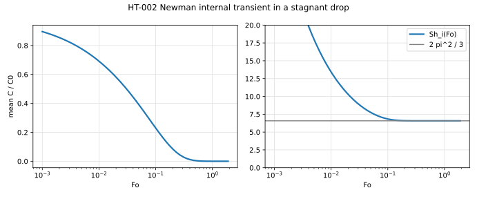
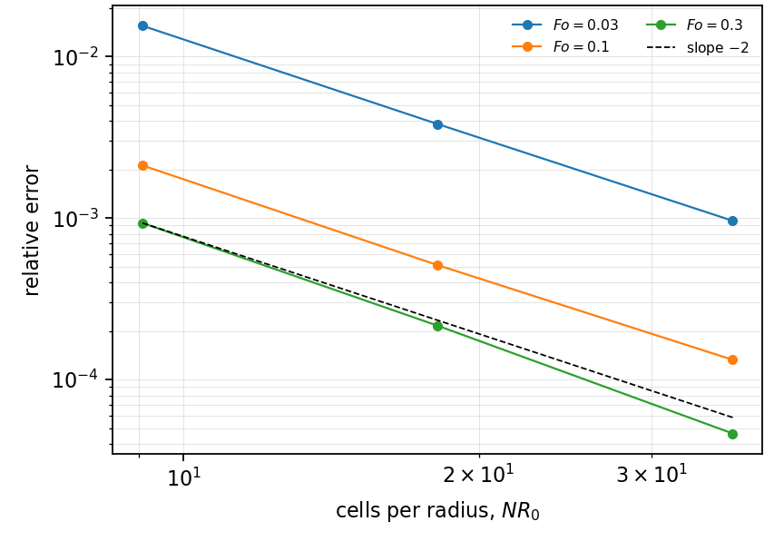
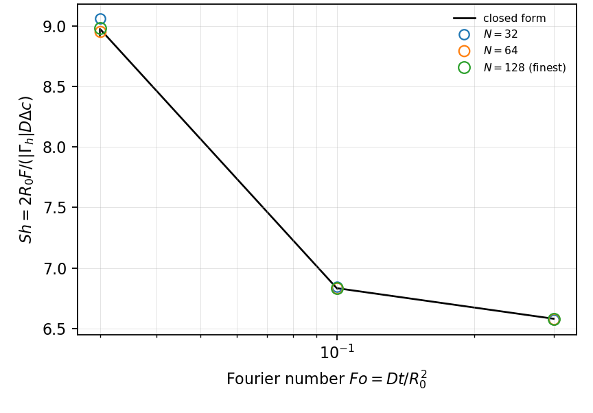

# HT-002 - Newman internal transient in a stagnant drop

## Problem

A spherical drop of radius $R_0$, initially uniform at $C_0$, with its surface
held at $C=0$. There is no flow inside or outside.

For $r<R_0$,

$$
\partial_t C = \frac{D}{r^2}\,\partial_r\!\left(r^2 \partial_r C\right).
$$

$$
C(R_0,t) = 0, \qquad C(r,0) = C_0, \qquad \partial_r C(0,t)=0 .
$$

## Parameters

| Parameter | Symbol |
|---|---|
| drop radius | $R_0$ |
| diffusivity | $D$ |
| initial concentration | $C_0$ |
| Fourier number | $\mathrm{Fo}=Dt/R_0^2$ |

## Reference

$$
\frac{\bar C(t)}{C_0} = \frac{6}{\pi^2}\sum_{n=1}^{\infty}
\frac{1}{n^2}\exp\!\left(-n^2\pi^2 \mathrm{Fo}\right),
$$

and the internal Sherwood number, defined from the decay of $\bar C$ by
$\mathrm{Sh}_i = -(d^2/6D)\,d\ln\bar C/dt$, tends to

$$
\mathrm{Sh}_i \to \frac{2\pi^2}{3} = 6.5797\ldots
$$

The same definition returns HT-003's circulating value from its own decay rate,
so the two bracket the internal resistance on one axis.

## Report

- $\bar C(\mathrm{Fo})$ against the series,
- $\mathrm{Sh}_i(\mathrm{Fo})$ and its approach to $2\pi^2/3$,
- observed convergence rate.

## Results

### Two-fluid cut-cell method - L. Libat, C. Selçuk, E. Chénier, V. Le Chenadec

Measured 2026-09-09. Uniform grid, N = 32/64/128, 8 MPI ranks. Fo = 0.030, 0.101, 0.300.

so every order is a real measurement.

| Fo | 0.030 | 0.101 | 0.300 |
|---|---|---|---|
| N = 32 | 1.55e-2 | 2.12e-3 | 9.33e-4 |
| N = 64 | 3.83e-3 | 5.12e-4 | 2.16e-4 |
| order | 2.02 | 2.05 | 2.11 |
| N = 128 | 9.63e-4 | 1.33e-4 | 4.64e-5 |
| order | 1.99 | 1.95 | 2.22 |

`Sh_i(Fo = 0.3) = 6.58012` against `2 pi^2 / 3 = 6.57974`, four digits from a
marched cut-cell solve.

## References

@newman1931
@colombet2013
