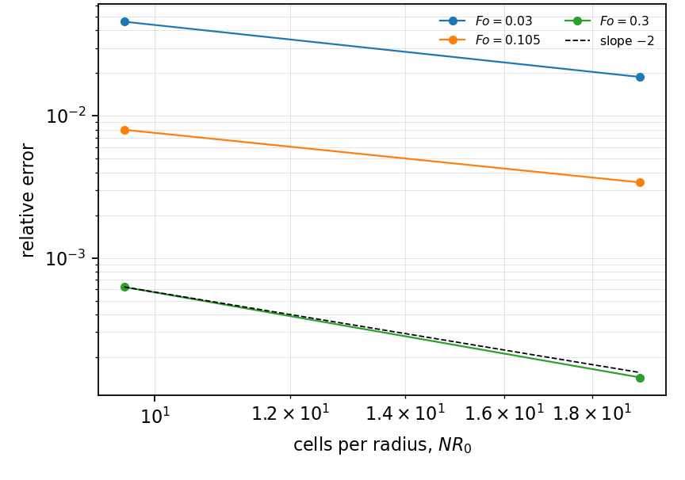
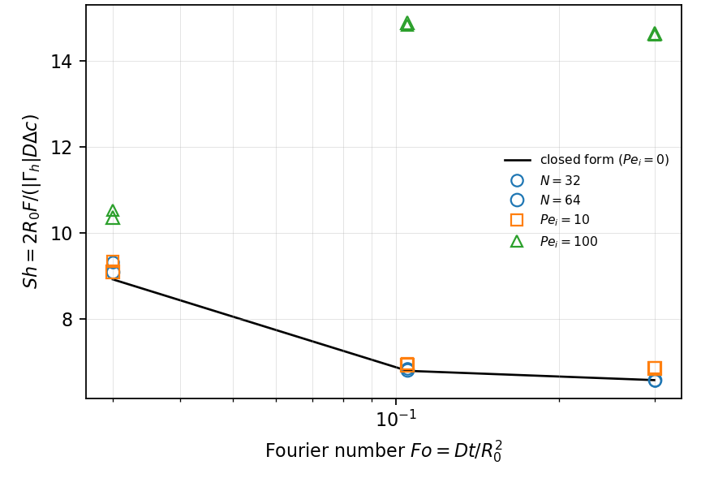

# HT-003 - Kronig-Brink circulating drop

## Problem

HT-002's drop, with the Hadamard-Rybczynski internal circulation imposed as a
prescribed steady velocity field in the creeping-flow limit
$\mathrm{Re}\to 0$, at large internal Peclet number. No momentum solve is
needed.

For $r<R_0$,

$$
\partial_t C + \mathbf{u}\cdot\nabla C = D \nabla^2 C ,
$$

with $\mathbf{u}$ the Hadamard interior field, whose streamlines are the
Hill spherical vortex.

$$
C(R_0,t) = 0, \qquad C(r,0) = C_0 .
$$

## Parameters

| Parameter | Symbol |
|---|---|
| drop radius | $R_0$ |
| diffusivity | $D$ |
| initial concentration | $C_0$ |
| internal Peclet number | $\mathrm{Pe}$ |

## Reference

At large $\mathrm{Pe}$ the mean concentration decays as
$\bar C \propto \exp(-64\lambda_1 D t/d^2)$, and with the same definition used
in HT-002, $\mathrm{Sh}_i = -(d^2/6D)\,d\ln \bar C/dt$,

$$
\mathrm{Sh}_i \to \frac{32\lambda_1}{3} = 17.90,
\qquad \lambda_1 = 1.678 .
$$

Quote the constant with its $\lambda_1$: the frequently cited 17.66 is the same
formula at the truncation $\lambda_1 = 1.656$, not a different definition. The
full $\mathrm{Sh}_i(\mathrm{Pe})$ curve interpolating between HT-002's 6.58 and
this value is given by the reference below, and is the target for a Peclet
sweep.

## Report

- $\mathrm{Sh}_i$ at large $\mathrm{Pe}$ against $32\lambda_1/3$,
- recovery of HT-002's 6.58 as $\mathrm{Pe}\to 0$,
- $\mathrm{Sh}_i(\mathrm{Pe})$ across the interpolation range,
- observed convergence rate.

## Results

### Two-fluid cut-cell method - L. Libat, C. Selçuk, E. Chénier, V. Le Chenadec

Measured 2026-09-09. Uniform grid, N = 32/64, 64 MPI ranks, three Fourier
samples per rung.

The control at $\mathrm{Pe}_i = 0$, against Newman, is the only row with a
closed form and so the only one carrying an error:

| Fo | 0.030 | 0.105 | 0.300 |
|---|---|---|---|
| rel. error, N = 32 | 4.59e-2 | 7.97e-3 | 6.23e-4 |
| rel. error, N = 64 | 1.87e-2 | 3.40e-3 | 1.44e-4 |
| order | 1.29 | 1.23 | 2.11 |

Second order at Fo = 0.3, where the Rannacher start has worked the initial jump
out of the field; the early samples are lower for the same reason.
$\mathrm{Sh}_i(\mathrm{Fo}=0.3) = 6.57947$ against $2\pi^2/3 = 6.5804$.

The bracket, at N = 64 and Fo = 0.3:

| Pe_i | 0 | 10 | 100 | 1000 |
|---|---|---|---|---|
| Sh_i | 6.579 | 6.854 | 14.642 | diverged |

Monotone in $\mathrm{Pe}_i$ and inside $[6.58, 17.90]$. **14.64 is 18% below
the Kronig-Brink plateau because $\mathrm{Pe}_i = 100$ is not infinity**; that
gap is physics, not discretisation, and the case gates the three statements it
can check at finite $\mathrm{Pe}_i$ — the Newman control, the bracket, and
monotonicity — rather than pretending to reach 17.90. A constant-preservation
solve puts the spurious convective source at 0.09% of
$\mathrm{Sh}_i$ at $\mathrm{Pe}_i = 100$, converging at second order, so the
gap is not contamination either.

$\mathrm{Pe}_i = 1000$ does not converge at either rung, the cell Peclet number
being 52 and 26; the rung is marked and abandoned after the first sample.
Reaching the plateau needs $\mathrm{Pe}_i \gtrsim 10^3$, hence N of about 256
on a marched two-phase solve in three dimensions. That is a cost, not a defect.

## References

@kronig1951
@colombet2013
