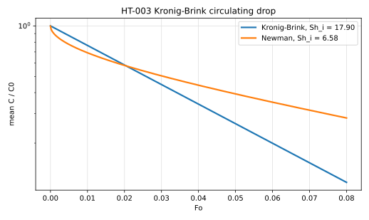

# HT-003 - Kronig-Brink circulating drop

## Problem

HT-002's drop, with the Hadamard-Rybczynski internal circulation imposed as a
prescribed steady velocity field in the creeping-flow limit
$\mathrm{Re}\to 0$, at large internal Peclet number. No momentum solve is
needed.

For $r<R_0$,

$$
\partial_t C + \mathbf{u}\cdot\nabla C = D \nabla^2 C ,
$$

with $\mathbf{u}$ the Hadamard interior field, whose streamlines are the
Hill spherical vortex.

$$
C(R_0,t) = 0, \qquad C(r,0) = C_0 .
$$

## Parameters

| Parameter | Symbol |
|---|---|
| drop radius | $R_0$ |
| diffusivity | $D$ |
| initial concentration | $C_0$ |
| internal Peclet number | $\mathrm{Pe}$ |

## Reference

At large $\mathrm{Pe}$ the mean concentration decays as
$\bar C \propto \exp(-64\lambda_1 D t/d^2)$, and with the same definition used
in HT-002, $\mathrm{Sh}_i = -(d^2/6D)\,d\ln \bar C/dt$,

$$
\mathrm{Sh}_i \to \frac{32\lambda_1}{3} = 17.90,
\qquad \lambda_1 = 1.678 .
$$

Quote the constant with its $\lambda_1$: the frequently cited 17.66 is the same
formula at the truncation $\lambda_1 = 1.656$, not a different definition. The
full $\mathrm{Sh}_i(\mathrm{Pe})$ curve interpolating between HT-002's 6.58 and
this value is given by the reference below, and is the target for a Peclet
sweep.

## Report

- $\mathrm{Sh}_i$ at large $\mathrm{Pe}$ against $32\lambda_1/3$,
- recovery of HT-002's 6.58 as $\mathrm{Pe}\to 0$,
- $\mathrm{Sh}_i(\mathrm{Pe})$ across the interpolation range,
- observed convergence rate.

## Results

### Two-fluid cut-cell method - L. Libat, C. Selçuk, E. Chénier, V. Le Chenadec

Measured 2026-09-09. Uniform grid, N = 32, 8 MPI ranks. Pe_i = 0, 10, 100, 1000.

| Pe_i | 0 | 10 | 100 | 1000 |
|---|---|---|---|---|
| Sh_i | 6.576 | 6.863 | 14.589 | diverged |

**Gate not met.** The `Pe_i = 0` control reproduces HT-002's Newman value to
0.06%, so the interior solve is right, but every row is at a single resolution:
there is no convergence ladder, and `Pe_i = 100` is only 82% of the way to the
`Pe_i -> inf` plateau. `Pe_i = 1000` does not converge at this resolution, where
the cell Peclet number is 52. Closing the case needs an axisymmetric metric or
a 3D ladder.

## References

@kronig1951
@colombet2013
