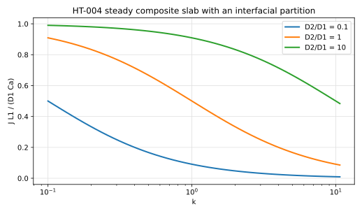

# HT-004 - Steady composite slab with an interfacial partition

## Problem

Two slabs in series between $x=0$ and $x=L_1+L_2$. Phase 1 occupies
$0<x<L_1$ with diffusivity $D_1$, phase 2 occupies $L_1<x<L_1+L_2$ with
diffusivity $D_2$. The outer faces are held at fixed values.

$$
\partial_x\left(D_i \partial_x C_i\right) = 0, \qquad i = 1,2 .
$$

$$
C_1(0) = C_a, \qquad C_2(L_1+L_2) = C_b,
$$

and at $x=L_1$,

$$
C_1 = k\,C_2, \qquad D_1 \partial_x C_1 = D_2 \partial_x C_2 .
$$

## Parameters

| Parameter | Symbol |
|---|---|
| slab thicknesses | $L_1$, $L_2$ |
| diffusivities | $D_1$, $D_2$ |
| partition coefficient | $k$ |
| face values | $C_a$, $C_b$ |

## Reference

The flux is constant through both slabs,

$$
J = \frac{C_a - k\,C_b}{L_1/D_1 + k L_2/D_2},
$$

the profile is piecewise linear, and the interfacial values are

$$
C_1(L_1) = C_a - J\,\frac{L_1}{D_1},
\qquad
C_2(L_1) = \frac{1}{k}\left(C_a - J\,\frac{L_1}{D_1}\right).
$$

The denominator is the sum of the two resistances, with the partition
coefficient weighting the second: the same statement as MT-005's
$1/\mathrm{Sh}_\mathrm{ov} = 1/2 + 1/(2\mathrm{Da}_s)$ and MT-008's
$1/\eta_\mathrm{ov} = 1/\eta + \phi^2/(3\mathrm{Bi})$, written across a
composite wall.

## Report

- $J$ against the closed form, at each $k$ and diffusivity ratio,
- the residual of $C_1 - kC_2$ at the interface,
- the flux measured on each side, which must agree,
- observed convergence rate.

## References

@Crank1975
@froment2011
