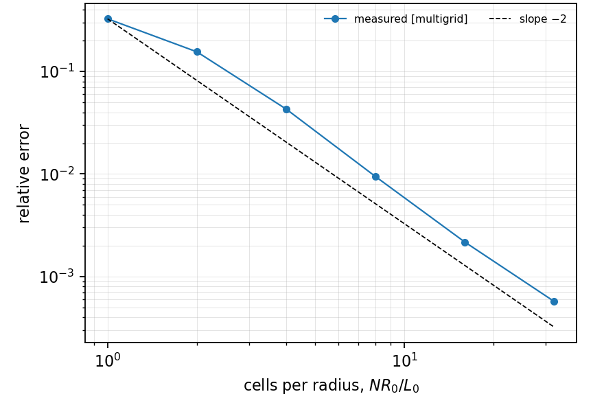
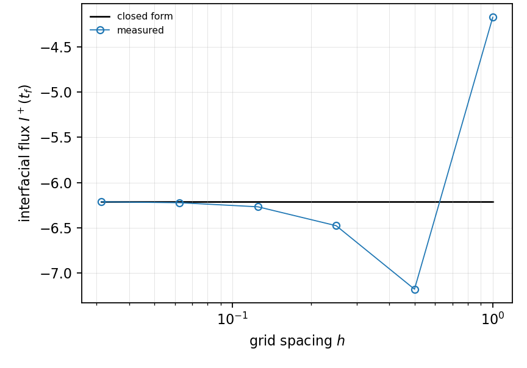
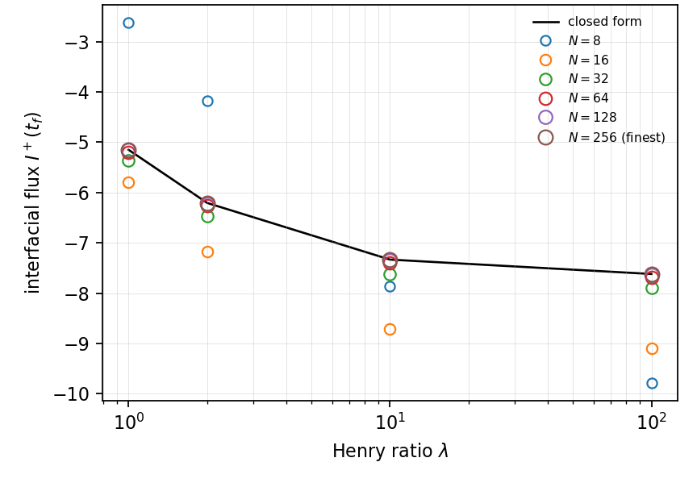

# HT-005 - Static circle with a Henry jump

## Problem

A circle of radius $R_0$ separates two phases with diffusivities $D_1$ inside
and $D_2$ outside. The inner field starts at $C_0$, the outer at zero, and the
box carries homogeneous Neumann conditions. The circle does not move.

$$
\partial_t C_i = D_i\nabla^2 C_i, \qquad i = 1, 2 .
$$

At $r = R_0$,

$$
C_1 = H\,C_2,
\qquad
D_1\partial_r C_1 = D_2\partial_r C_2 .
$$

## Parameters

| Parameter | Symbol |
|---|---|
| circle radius | $R_0$ |
| diffusivity, inside | $D_1$ |
| diffusivity, outside | $D_2$ |
| partition coefficient | $H$ |
| initial inner value | $C_0$ |
| final time | $t_\mathrm{end}$ |

## Reference

With $\varepsilon = \sqrt{D_1/D_2}$ the solution is a Bessel integral on each
side,

$$
C_1(r,t) = \frac{4C_0 H D_1 D_2^2}{\pi^2 R_0}
\int_0^\infty
\frac{e^{-D_1 u^2 t} J_0(ur) J_1(uR_0)}{u^2\left[\Phi^2 + \Psi^2\right]}\,du ,
$$

$$
C_2(r,t) = \frac{2C_0 H D_1\sqrt{D_2}}{\pi}
\int_0^\infty
\frac{e^{-D_1 u^2 t} J_1(uR_0)
\left[J_0(\varepsilon ur)\Phi - Y_0(\varepsilon ur)\Psi\right]}
{u\left[\Phi^2 + \Psi^2\right]}\,du ,
$$

with

$$
\Phi = D_1\sqrt{D_2}\,J_1(R_0u)Y_0(\varepsilon R_0u)
     - H D_2\sqrt{D_1}\,J_0(R_0u)Y_1(\varepsilon R_0u),
$$

$$
\Psi = D_1\sqrt{D_2}\,J_1(R_0u)J_0(\varepsilon R_0u)
     - H D_2\sqrt{D_1}\,J_0(R_0u)J_1(\varepsilon R_0u).
$$

The closed form **jumps** at $r = R_0$. It must be evaluated per phase, or only
at the interface where the observables live; a single radial table interpolated
across the interface returns, in exactly the cut cells, a value belonging to
neither phase, and the error then grows under refinement.

## Report

- the interfacial flux and the two interfacial traces,
- the residual of $C_1 - H C_2$, which is algebraic and should reach zero
  exactly,
- the conservation budget,
- the same flux error across several decades of $H$,
- observed convergence rate.

A time scheme with a Crank-Nicolson half step reads the initial traces through
its explicit half, where they satisfy no interface row. Two backward-Euler half
steps at the start fix it; without them the budget drifts by 2e-2 instead of by
round-off.

## Results

### Two-fluid cut-cell method - L. Libat, C. Selçuk, E. Chénier, V. Le Chenadec

Measured 2026-09-09. Uniform grid, N = 8 to 256, 16 MPI ranks, $H = 2$,
interfacial flux at $t_f$.

| h | 1 | 0.5 | 0.25 | 0.125 | 0.0625 | 0.03125 |
|---|---|---|---|---|---|---|
| rel. error | 3.3e-1 | 1.6e-1 | 4.3e-2 | 9.4e-3 | 2.2e-3 | 5.7e-4 |
| order | | 1.07 | 1.86 | 2.19 | 2.12 | 1.93 |

Across four decades of the Henry ratio at N = 256 the flux error stays at
5.5e-4 to 5.7e-4: the jump row does not care how large the jump is.

| H | 1 | 2 | 10 | 100 |
|---|---|---|---|---|
| rel. error | 5.5e-4 | 5.7e-4 | 5.6e-4 | 5.6e-4 |

The jump row closes at exactly 0.0e+00 at every rung and every $H$, and
the conservation budget holds to 3e-13, which tracks the solver tolerance
rather than the scheme.

## References

@libat2025st
@Crank1975
