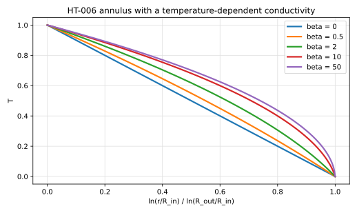
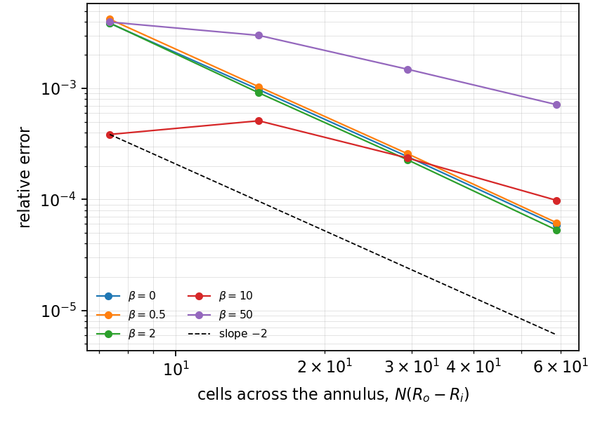
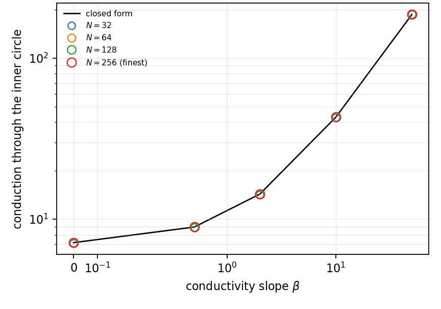

# HT-006 - Annulus with a temperature-dependent conductivity

## Problem

Steady conduction in an annulus whose conductivity varies with the temperature,

$$
\nabla\cdot\left(\kappa(T)\nabla T\right) = 0,
\qquad
\kappa(T) = \kappa_0\left(1 + \beta T\right) ,
$$

with $T = 1$ on the inner circle and $T = 0$ on the outer one.

## Parameters

| Parameter | Symbol |
|---|---|
| inner radius | $R_\mathrm{in}$ |
| outer radius | $R_\mathrm{out}$ |
| reference conductivity | $\kappa_0$ |
| conductivity slope | $\beta$ |

## Reference

The Kirchhoff transform

$$
\theta = T + \frac{\beta T^2}{2}
$$

makes $\theta$ harmonic, so it is the logarithmic profile of the linear
problem,

$$
\theta(r) = \theta_\mathrm{in}
\left(1 - \frac{\ln(r/R_\mathrm{in})}{\ln(R_\mathrm{out}/R_\mathrm{in})}\right),
\qquad
T = \frac{\sqrt{1 + 2\beta\theta} - 1}{\beta} .
$$

The flux through the annulus therefore scales exactly,

$$
\frac{F(\beta)}{F(0)} = 1 + \frac{\beta}{2} ,
$$

which is a one-line reference the nonlinear solve has no way of knowing.

## Report

- the flux against $F(0)(1 + \beta/2)$,
- the in/out balance across the annulus,
- the temperature profile,
- the iteration count against the conductivity contrast,
- observed convergence rate.

## Results

### Two-fluid cut-cell method - L. Libat, C. Selçuk, E. Chénier, V. Le Chenadec

Measured 2026-09-08. Uniform grid, N = 32 to 256, 16 MPI ranks, Picard
iteration on the nonlinearity. Relative error on the flux at N = 256.

| beta | 0 | 0.5 | 2 | 10 | 50 |
|---|---|---|---|---|---|
| Sh | 7.159 | 8.949 | 14.319 | 42.964 | 186.29 |
| rel. error | 5.8e-5 | 6.2e-5 | 5.3e-5 | 9.8e-5 | 7.1e-4 |
| order | 2.06 | 2.06 | 2.10 | 1.27 | 1.06 |

Second order over the first three columns; the last two lose order as the
conductivity contrast reaches 51 and the Picard count goes from 2 to 35. The
annulus in/out balance closes at 1e-15 throughout.

## References

@carslaw1959
@Crank1975
