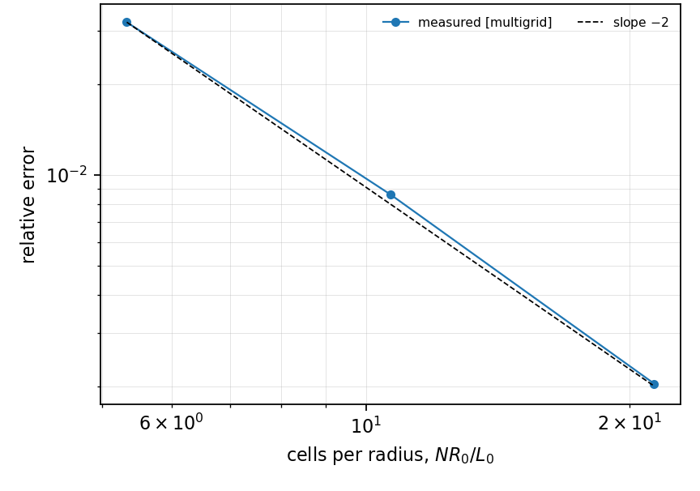
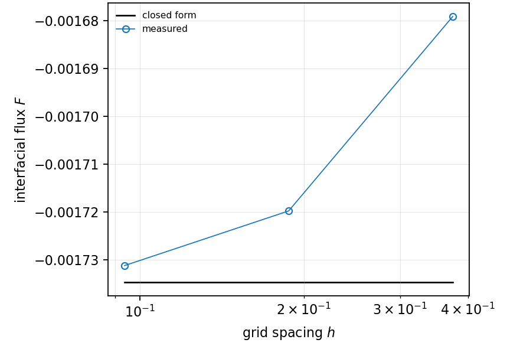

# HT-007 - Static bubble with a Henry jump

## Problem

A sphere of radius $R_0$ holds gas with diffusivity $D_g$, surrounded by liquid
with diffusivity $D_l$. The gas starts uniform at $c_{g0}$, the liquid at zero,
and the bubble does not move.

$$
\partial_t c_g = D_g\nabla^2 c_g,
\qquad
\partial_t c_l = D_l\nabla^2 c_l .
$$

At $r = R_0$,

$$
\frac{c_l}{c_g} = \alpha,
\qquad
D_g\partial_r c_g = D_l\partial_r c_l .
$$

## Parameters

| Parameter | Symbol |
|---|---|
| bubble radius | $R_0$ |
| diffusivity, gas | $D_g$ |
| diffusivity, liquid | $D_l$ |
| Henry coefficient | $\alpha$ |
| initial gas value | $c_{g0}$ |

## Reference

In Laplace space, with $\ell_i = \sqrt{s/D_i}$,

$$
\tilde{c}_g = \frac{c_{g0}}{s}\left(1 - \frac{2\sinh(\ell_g r)}{\zeta r}\right),
\qquad
\tilde{c}_l = \frac{\xi\,c_{g0}\,e^{-\ell_l r}}{s\,\zeta\,r} ,
$$

$$
\xi = \frac{2D_g\left(\ell_g R_0\cosh(\ell_g R_0) - \sinh(\ell_g R_0)\right)}
{D_l e^{-\ell_l R_0}\left(1 + \ell_l R_0\right)},
\qquad
\zeta = \frac{\xi e^{-\ell_l R_0}}{\alpha R_0} + \frac{2\sinh(\ell_g R_0)}{R_0} ,
$$

inverted by a keyhole contour on the branch cut. This is the three-dimensional
counterpart of HT-005's Bessel integral, and it is the reference implementation
of the competing volume-of-fluid treatment as much as a closed form: the
observable is the interfacial flux, which is negative, the bubble losing what
it started with.

## Report

- the interfacial flux against the inversion,
- the residual of the Henry condition,
- the conservation budget,
- observed convergence rate.

A test that suppresses a reference line whenever the reference is negative will
silently delete this case's reference; the test for "no reference here" is
finiteness, never a sign.

## Results

### Two-fluid cut-cell method - L. Libat, C. Selçuk, E. Chénier, V. Le Chenadec

Measured 2026-09-08. Uniform grid, N = 16/32/64, 8 MPI ranks, interfacial flux.

| N | 16 | 32 | 64 |
|---|---|---|---|
| cells per radius | 5.3 | 10.7 | 21.3 |
| rel. error | 3.2e-2 | 8.6e-3 | 2.0e-3 |
| order | | 1.89 | 2.08 |

The ladder stops at N = 64. At a diffusivity ratio $D_g/D_l = 10$ the
three-dimensional two-phase multigrid stops converging at N = 128; that is a
solver limit, it is reported rather than worked around, and it is the same
limit that caps the conjugate sphere of VC-006.

## References

@farsoiya2021
@libat2025st
