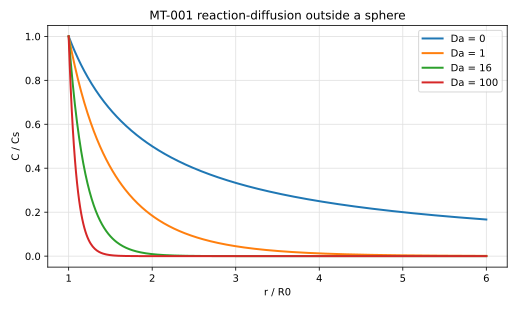

# MT-001 - Steady reaction-diffusion outside a sphere

## Purpose

Verifies steady transfer from a sphere into a medium that consumes the
transferred species by a first-order bulk reaction. It is the minimal case in
which the transfer rate is set by a reaction layer rather than by the domain
size, and it fixes the Sherwood and Damkohler conventions used throughout the
`MT` family.

## Physical Configuration

A sphere of radius $R_0$ holds its surface at concentration $C_s$. The
surrounding medium is quiescent and consumes the species at rate $\nu C$.

## Governing Equations

For $r > R_0$,

$$
D \nabla^2 C = \nu C .
$$

## Boundary And Initial Conditions

$$
C(R_0) = C_s, \qquad C(r \to \infty) = 0 .
$$

## Material Parameters

| Parameter | Symbol | Value |
|---|---:|---:|
| sphere radius | $R_0$ | 1 |
| diffusivity | $D$ | 1 |
| surface concentration | $C_s$ | 1 |
| Damkohler number | $\mathrm{Da}=\nu R_0^2/D$ | 0 to 100 |

## Reference Solution

$$
\frac{C(r)}{C_s} = \frac{R_0}{r}
\exp\left(-\sqrt{\mathrm{Da}}\,\frac{r-R_0}{R_0}\right),
$$

and the diameter-based Sherwood number is

$$
\mathrm{Sh} = \frac{2 R_0 k_c}{D} = 2\left(1+\sqrt{\mathrm{Da}}\right).
$$

The conventions matter: $\mathrm{Sh}$ is diameter-based, so $\mathrm{Sh}\to 2$
at $\mathrm{Da}=0$, while $\mathrm{Da}$ is radius-based. A diameter-based
Damkohler number would give $2(1+\phi/2)$ and look like a factor-of-two error.

## Recommended Numerical Setup

Use a cubic box of side $L \ge 40 R_0$, or impose the reference profile on the
outer boundary at smaller $L$. The reaction layer has thickness
$R_0/\sqrt{\mathrm{Da}}$, so the cell count across it,
$n/\ell = N R_0 / \sqrt{\mathrm{Da}}$, and not $\mathrm{Da}$ itself, sets the
error. About four cells per layer are needed for 1% on $\mathrm{Sh}$.

## Quantities To Report

- $\mathrm{Sh}$ at each $\mathrm{Da}$ and its relative error,
- radial concentration profile at $\mathrm{Da} = 1$ and $100$,
- observed convergence rate under grid refinement,
- cells per reaction layer at which 1% on $\mathrm{Sh}$ is reached.

## Known Difficulties

- truncating the box before the reaction layer is resolved,
- confusing radius-based and diameter-based groups,
- at $\mathrm{Da}=0$ the box truncation, not the scheme, limits accuracy.

## References

@frankkamenetskii1969
@fogler2016
