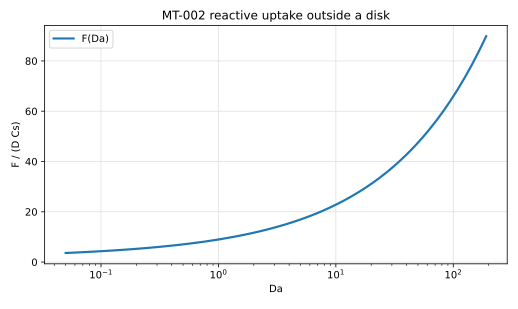
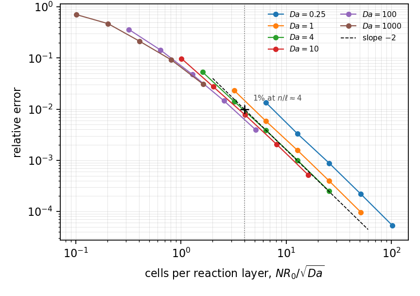
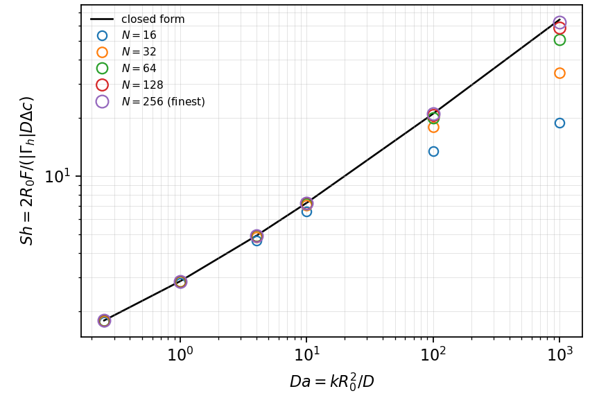

# MT-002 - Steady reactive uptake outside a disk

## Problem

A disk of radius $R_0$ at concentration $C_s$ in a quiescent plane that
consumes the species at rate $\nu C$.

For $r > R_0$,

$$
D \nabla^2 C = \nu C .
$$

$$
C(R_0) = C_s, \qquad C(r \to \infty) = 0 .
$$

## Parameters

| Parameter | Symbol |
|---|---|
| disk radius | $R_0$ |
| diffusivity | $D$ |
| surface concentration | $C_s$ |
| Damkohler number | $\mathrm{Da}=\nu R_0^2/D$ |

## Reference

With $m=\sqrt{\mathrm{Da}}/R_0$,

$$
\frac{C(r)}{C_s} = \frac{K_0(m r)}{K_0(m R_0)},
$$

and the uptake per unit depth is

$$
F = 2\pi R_0 D C_s\, m \,\frac{K_1(m R_0)}{K_0(m R_0)}
  = 2\pi D C_s \sqrt{\mathrm{Da}}\,
    \frac{K_1(\sqrt{\mathrm{Da}})}{K_0(\sqrt{\mathrm{Da}})} .
$$

## Report

- $F$ at each $\mathrm{Da}$ and its relative error,
- radial profile against $K_0(mr)/K_0(mR_0)$,
- observed convergence rate,
- the drift of $F$ with box size at fixed $h$, at low and high $\mathrm{Da}$.

## Results

### Two-fluid cut-cell method - L. Libat, C. Selçuk, E. Chénier, V. Le Chenadec

Measured 2026-09-09. Uniform grid, N = 128, 16 MPI ranks, with a confirmation rung at N = 256. Da = 0.25, 1, 4, 10, 100, 1000.

| Da | 0.25 | 1 | 4 | 10 | 100 | 1000 |
|---|---|---|---|---|---|---|
| n/l | 51.2 | 25.6 | 12.8 | 8.1 | 2.6 | 0.8 |
| rel. error | 2.2e-4 | 4.0e-4 | 1.0e-3 | 2.1e-3 | 1.5e-2 | 9.2e-2 |
| order | 2.01 | 1.99 | 1.95 | 1.92 | 1.71 | 1.21 |

A confirmation rung at N = 256 gives 5.3e-5 to 3.1e-2, orders 2.05 down to 1.57.

## References

@frankkamenetskii1969
@Crank1975
