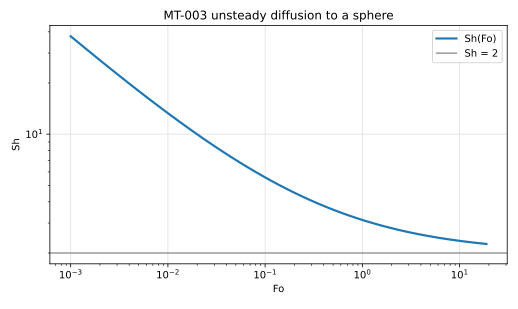

# MT-003 - Unsteady diffusion to a sphere

## Problem

A sphere of radius $R_0$ is held at $C=C_s$ from $t=0$ in an infinite medium
initially at $C=0$. There is no flow and no reaction.

For $r > R_0$,

$$
\partial_t C = D \nabla^2 C .
$$

$$
C(R_0,t) = C_s, \qquad C(r,0) = 0, \qquad C(r\to\infty,t)=0 .
$$

## Parameters

| Parameter | Symbol | Value |
|---|---:|---:|
| sphere radius | $R_0$ | 1 |
| diffusivity | $D$ | 1 |
| surface concentration | $C_s$ | 1 |
| Fourier number | $\mathrm{Fo}=Dt/R_0^2$ | 0.001 to 10 |

## Reference

With $\xi = (r-R_0)/R_0$,

$$
\frac{C}{C_s} = \frac{1}{1+\xi}\,
\operatorname{erfc}\!\left(\frac{\xi}{2\sqrt{\mathrm{Fo}}}\right),
$$

and

$$
\mathrm{Sh}(\mathrm{Fo}) = 2 + \frac{2}{\sqrt{\pi \mathrm{Fo}}} .
$$

## Report

- $\mathrm{Sh}(\mathrm{Fo})$ against the closed form,
- the approach to $\mathrm{Sh}=2$ at large $\mathrm{Fo}$,
- profiles at $\mathrm{Fo}=0.01$, $0.1$ and $1$,
- observed convergence rate in space and in time.

## Results

Measured with the `basilisk-libat` cut-cell solver, 2026-09-09.

N = 64 uniform, Crank-Nicolson, 8 ranks, Da = 0.

| Fo | 0.05 | 0.15 | 0.50 |
|---|---|---|---|
| rel. error | 4.3e-3 | 8.3e-4 | 1.6e-3 |
| order | 1.86 | 2.61 | 2.32 |

## References

@Crank1975
