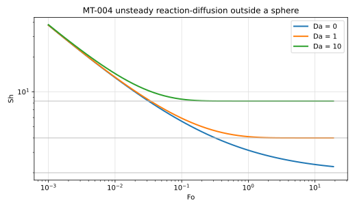
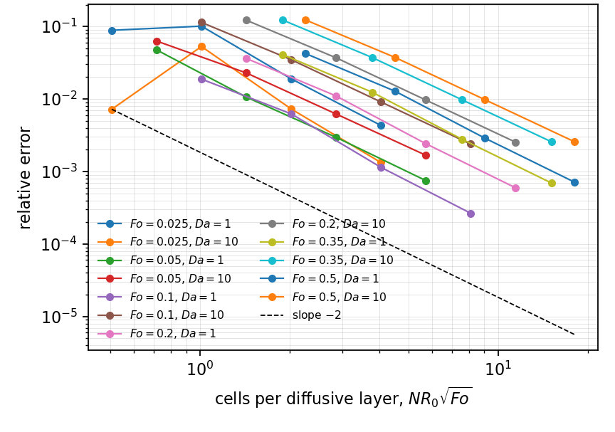
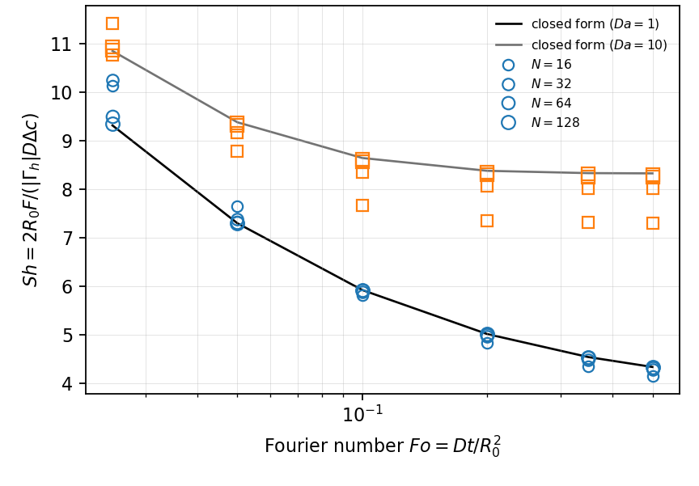

# MT-004 - Unsteady diffusion with a first-order reaction outside a sphere

## Problem

MT-003's sphere in a medium that also consumes the species at rate $\nu C$.

For $r > R_0$,

$$
\partial_t C = D \nabla^2 C - \nu C .
$$

$$
C(R_0,t) = C_s, \qquad C(r,0) = 0, \qquad C(r\to\infty,t)=0 .
$$

## Parameters

| Parameter | Symbol |
|---|---|
| sphere radius | $R_0$ |
| diffusivity | $D$ |
| surface concentration | $C_s$ |
| Damkohler number | $\mathrm{Da}=\nu R_0^2/D$ |
| Fourier number | $\mathrm{Fo}=Dt/R_0^2$ |

## Reference

With $\xi=(r-R_0)/R_0$ and $m=\sqrt{\mathrm{Da}}$,

$$
\frac{C}{C_s} = \frac{1}{2(1+\xi)}
\left[
e^{-m\xi}\operatorname{erfc}\!\left(\frac{\xi}{2\sqrt{\mathrm{Fo}}}-m\sqrt{\mathrm{Fo}}\right)
+
e^{+m\xi}\operatorname{erfc}\!\left(\frac{\xi}{2\sqrt{\mathrm{Fo}}}+m\sqrt{\mathrm{Fo}}\right)
\right],
$$

and

$$
\mathrm{Sh}(\mathrm{Fo},\mathrm{Da}) = 2\left[
1 + \sqrt{\mathrm{Da}}\,\operatorname{erf}\!\left(\sqrt{\mathrm{Da}\,\mathrm{Fo}}\right)
+ \frac{e^{-\mathrm{Da}\,\mathrm{Fo}}}{\sqrt{\pi \mathrm{Fo}}}
\right].
$$

This follows from the Laplace transform of $u=rC$: with
$\hat u = (R_0/s)\exp(-q(r-R_0))$ and $q=\sqrt{(s+\nu)/D}$, the surface
gradient gives $\hat{\mathrm{Sh}} = 2 + (2R_0/\sqrt{D})\sqrt{s+\nu}/s$, whose
inverse is the expression above. MT-001 is the limit
$\mathrm{Fo}\to\infty$ and MT-003 the limit $\mathrm{Da}\to 0$.

## Report

- $\mathrm{Sh}(\mathrm{Fo})$ at each $\mathrm{Da}$,
- recovery of $2(1+\sqrt{\mathrm{Da}})$ at large $\mathrm{Fo}$,
- recovery of MT-003 at $\mathrm{Da}=0$,
- observed convergence rate in space and in time.

## Results

### Two-fluid cut-cell method - L. Libat, C. Selçuk, E. Chénier, V. Le Chenadec

Measured 2026-09-09. Uniform grid, N = 64, Crank-Nicolson in time, 8 MPI ranks. Da = 1 and 10, Fo = 0.05, 0.15, 0.50.

| Fo | 0.05 | 0.15 | 0.50 |
|---|---|---|---|
| Da = 1, rel. error | 3.0e-3 | 2.1e-3 | 2.9e-3 |
| Da = 1, order | 1.84 | 2.23 | 2.15 |
| Da = 10, rel. error | 6.2e-3 | 9.6e-3 | 9.8e-3 |
| Da = 10, order | 1.88 | 1.93 | 1.93 |

Time-step ladder at fixed N, against the same grid's finest-step solution:
1.09 to 1.23 for backward Euler, 1.5 to 1.8 for Crank-Nicolson.

## References

@Crank1975
@frankkamenetskii1969
