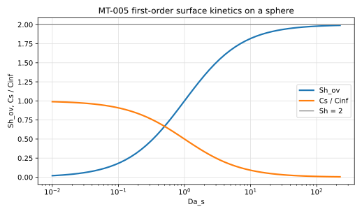
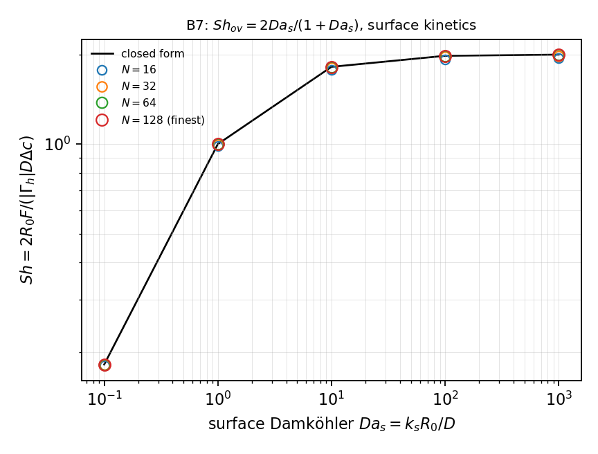

# MT-005 - First-order surface kinetics on a sphere

## Problem

A sphere of radius $R_0$ consumes the species at its surface at rate
$k_s C_s$, in a quiescent medium of far-field concentration $C_\infty$. There
is no bulk reaction.

For $r > R_0$,

$$
\nabla^2 C = 0 .
$$

At the surface, consumption balances the diffusive supply,

$$
k_s C(R_0) = D\, \partial_r C(R_0),
$$

and $C(r\to\infty) = C_\infty$.

## Parameters

| Parameter | Symbol |
|---|---|
| sphere radius | $R_0$ |
| diffusivity | $D$ |
| far-field concentration | $C_\infty$ |
| surface Damkohler number | $\mathrm{Da}_s = k_s R_0/D$ |

## Reference

$$
\frac{C(r)}{C_\infty} = 1 - \frac{R_0}{r}\,
\frac{\mathrm{Da}_s}{1+\mathrm{Da}_s},
\qquad
\frac{C_s}{C_\infty} = \frac{1}{1+\mathrm{Da}_s},
$$

and the overall Sherwood number obeys a resistances-in-series law,

$$
\mathrm{Sh}_\mathrm{ov} = \frac{2\,\mathrm{Da}_s}{1+\mathrm{Da}_s},
\qquad
\frac{1}{\mathrm{Sh}_\mathrm{ov}} = \frac{1}{2} + \frac{1}{2\,\mathrm{Da}_s} .
$$

The limits bracket every reactive particle: $\mathrm{Da}_s \to \infty$ gives
the diffusion-controlled sphere $\mathrm{Sh}=2$, and $\mathrm{Da}_s \to 0$
gives the kinetics-controlled $\mathrm{Sh}=2\,\mathrm{Da}_s$.

## Report

- $\mathrm{Sh}_\mathrm{ov}$ across $\mathrm{Da}_s$,
- the solved surface trace $C_s/C_\infty$ against $1/(1+\mathrm{Da}_s)$,
- linearity of $1/\mathrm{Sh}_\mathrm{ov}$ in $1/\mathrm{Da}_s$,
- observed convergence rate.

## Results

### Two-fluid cut-cell method

L. Libat, C. Selçuk, E. Chénier, V. Le Chenadec. Measured 2026-09-09.

Uniform grid, N = 64, 8 MPI ranks. Da_s = 0.1, 1, 10, 100, 1000.

| Da_s | 0.1 | 1 | 10 | 100 | 1000 |
|---|---|---|---|---|---|
| rel. error | 2.3e-4 | 9.6e-4 | 1.7e-3 | 1.9e-3 | 1.9e-3 |
| order | 2.20 | 2.21 | 2.23 | 2.24 | 2.24 |

The errors on `Sh_ov` and on the solved `c_s` are the same numbers, because
`Sh_ov = 2 Da_s c_s` with `Da_s` exact: measuring the solved surface
concentration and measuring the transfer are one measurement.

## References

@taylor1963
@collins1949
@lu2018
