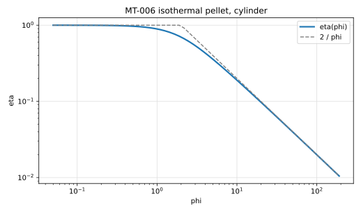
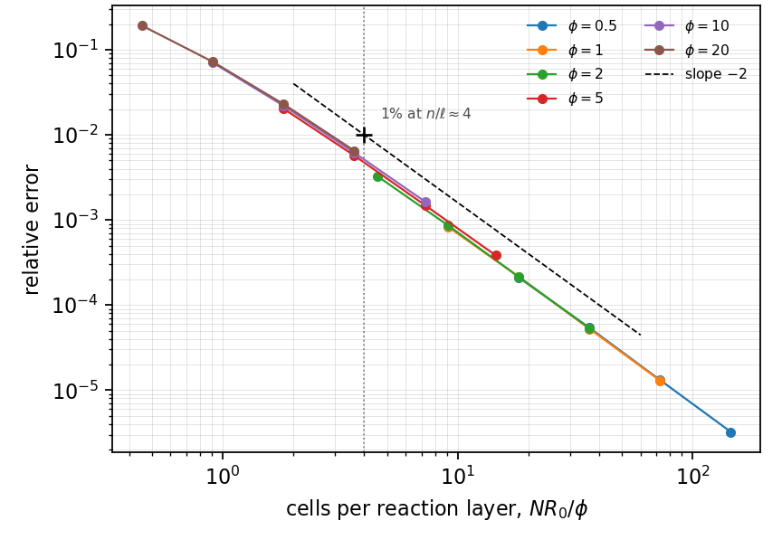
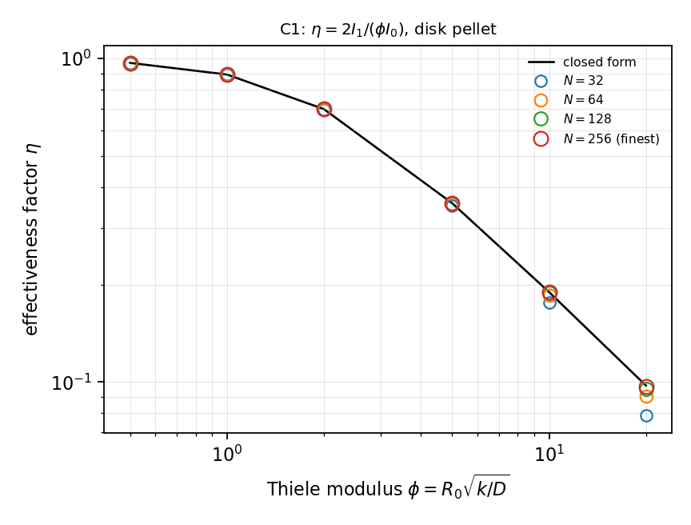

# MT-006 - Isothermal catalyst pellet, cylinder

## Problem

A cylindrical pellet of radius $R_0$ holds its surface at $C_s$ and consumes the
species internally at rate $k C$.

For $r < R_0$,

$$
D \nabla^2 C = k C .
$$

$$
C(R_0) = C_s, \qquad \partial_r C(0) = 0 .
$$

## Parameters

| Parameter | Symbol |
|---|---|
| pellet radius | $R_0$ |
| diffusivity | $D$ |
| surface concentration | $C_s$ |
| Thiele modulus | $\phi = R_0\sqrt{k/D}$ |

## Reference

$$
\frac{C(r)}{C_s} = \frac{I_0(\phi r/R_0)}{I_0(\phi)},
\qquad
\eta = \frac{2 I_1(\phi)}{\phi I_0(\phi)} .
$$

The asymptote is $\eta \to 2/\phi$.

## Report

- $\eta(\phi)$ and its relative error,
- agreement of the two routes to $\eta$,
- radial profile at $\phi=5$,
- observed convergence rate.

## Results

### Two-fluid cut-cell method - L. Libat, C. Selçuk, E. Chénier, V. Le Chenadec

Measured 2026-09-09. Uniform grid, N = 128, two dimensions, 16 MPI ranks. phi = 0.5, 1, 2, 5, 10, 20.

| phi | 0.5 | 1 | 2 | 5 | 10 | 20 |
|---|---|---|---|---|---|---|
| rel. error | 1.3e-5 | 5.3e-5 | 2.2e-4 | 1.5e-3 | 6.2e-3 | 2.3e-2 |
| order | 2.04 | 2.04 | 2.01 | 1.94 | 1.83 | 1.65 |

## References

@thiele1939
@aris1975
