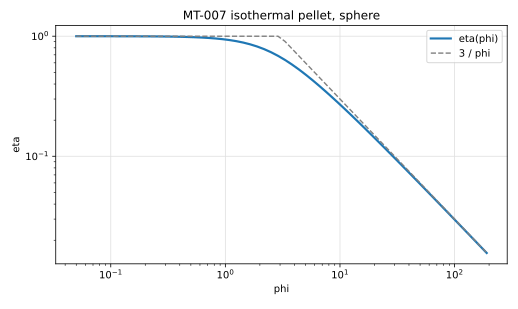
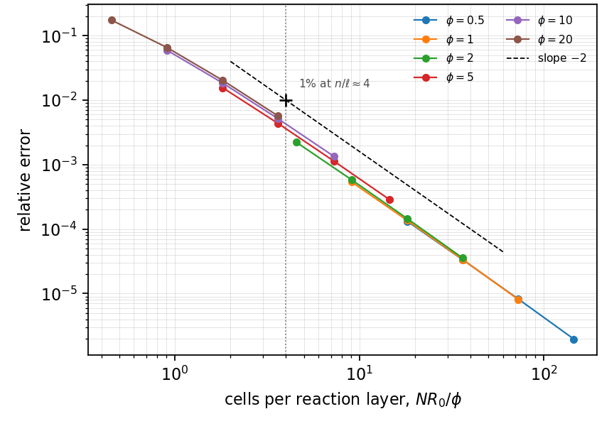
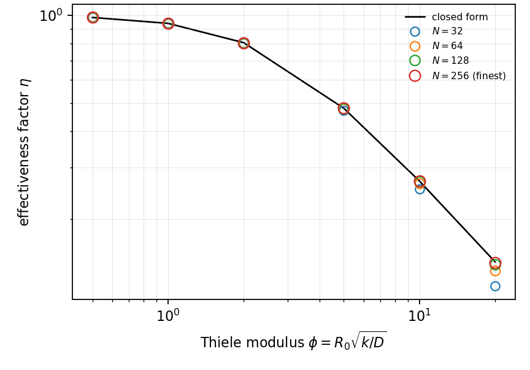

# MT-007 - Isothermal catalyst pellet, sphere

## Problem

A spherical pellet of radius $R$ at surface concentration $C_s$, consuming the
species internally at rate $k C$.

For $r < R$,

$$
D \nabla^2 C = k C .
$$

$$
C(R) = C_s, \qquad \partial_r C(0) = 0 .
$$

## Parameters

| Parameter | Symbol |
|---|---|
| pellet radius | $R$ |
| diffusivity | $D$ |
| surface concentration | $C_s$ |
| Thiele modulus | $\phi = R\sqrt{k/D}$ |

## Reference

$$
\frac{C(r)}{C_s} = \frac{R}{r}\,\frac{\sinh(\phi r/R)}{\sinh \phi},
\qquad
\eta = \frac{3}{\phi^2}\left(\phi \coth \phi - 1\right).
$$

The same result in the characteristic-length convention $L=(R/3)\sqrt{k/D}$
reads $\eta = (1/L)\left(1/\tanh(3L) - 1/(3L)\right)$. Fix one convention and
state it: this is the standard source of a factor-of-three disagreement. The
asymptote is $\eta \to 3/\phi$.

## Report

- $\eta(\phi)$ and its relative error,
- agreement of the two routes to $\eta$,
- radial profile at $\phi=5$,
- observed convergence rate.

## Results

### Two-fluid cut-cell method - L. Libat, C. Selçuk, E. Chénier, V. Le Chenadec

Measured 2026-09-09. Uniform grid, N = 64, three dimensions, 8 MPI ranks. phi = 0.5, 1, 2, 5, 10, 20.

| phi | 0.5 | 1 | 2 | 5 | 10 | 20 |
|---|---|---|---|---|---|---|
| rel. error | 3.3e-5 | 1.4e-4 | 5.8e-4 | 4.4e-3 | 1.9e-2 | 6.6e-2 |
| order | 1.99 | 1.98 | 1.95 | 1.84 | 1.69 | 1.41 |

The two routes to `eta`, the interface flux and the volume-averaged
concentration, agree to 1e-12 to 1e-16 at every rung and every phi.

## References

@thiele1939
@fogler2016
