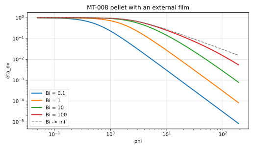

# MT-008 - Catalyst pellet with an external film

## Purpose

MT-005's mirror. MT-005 puts a Robin condition on the exterior field with the
kinetics at the surface; this case puts one on the interior field with the
resistance in an external film. Together they show the condition is correct in
both phases and for both signs of the driving force. It is also the honest form
of the pellet problem, since $\eta$ alone assumes an infinite Biot number,
which no particle in a real suspension has.

## Physical Configuration

MT-007's pellet, with the surface concentration no longer imposed: an external
film of mass-transfer coefficient $k_g$ separates the surface from a bulk at
$C_b$.

## Governing Equations

For $r < R$,

$$
D \nabla^2 C = k C .
$$

## Boundary And Initial Conditions

$$
k_g\left(C_b - C(R)\right) = D\,\partial_r C(R), \qquad \partial_r C(0) = 0 .
$$

## Material Parameters

| Parameter | Symbol | Value |
|---|---:|---:|
| pellet radius | $R$ | 1 |
| diffusivity | $D$ | 1 |
| bulk concentration | $C_b$ | 1 |
| Thiele modulus | $\phi = R\sqrt{k/D}$ | 0.1 to 20 |
| Biot number | $\mathrm{Bi} = k_g R/D$ | 0.1 to 100 |

## Reference Solution

$$
\frac{C_s}{C_b} = \frac{1}{1 + \left(\phi \coth \phi - 1\right)/\mathrm{Bi}},
\qquad
\eta_\mathrm{ov} = \frac{\eta(\phi)}{1 + \phi^2 \eta(\phi)/(3\,\mathrm{Bi})},
$$

with $\eta(\phi)$ from MT-007. The limits are MT-007 exactly as
$\mathrm{Bi}\to\infty$, and $\eta_\mathrm{ov} \to 3\,\mathrm{Bi}/\phi^2$ as
$\mathrm{Bi}\to 0$.

The identity $1/\eta_\mathrm{ov} = 1/\eta + \phi^2/(3\,\mathrm{Bi})$ is the
same statement as MT-005's $1/\mathrm{Sh}_\mathrm{ov} = 1/2 + 1/(2\mathrm{Da}_s)$:
resistances in series, measured on the two sides of the interface.

## Recommended Numerical Setup

As MT-007. Sweep $\mathrm{Bi}$ at fixed $\phi$ and check that MT-007 is
recovered as $\mathrm{Bi}$ grows.

## Quantities To Report

- $\eta_\mathrm{ov}(\phi,\mathrm{Bi})$ and its relative error,
- the solved surface trace $C_s/C_b$,
- linearity of $1/\eta_\mathrm{ov}$ in $1/\mathrm{Bi}$,
- recovery of MT-007 at large $\mathrm{Bi}$.

## Known Difficulties

- a finite box making the effective film resistance larger than intended,
- confusing the film coefficient with the exterior Sherwood number: the two are
  related by $\mathrm{Bi} = \mathrm{Sh}_\mathrm{ext}/(2\gamma)$ with
  $\gamma = D_s/D_f$.

## References

@fogler2016
@froment2011
@sulaiman2019b
