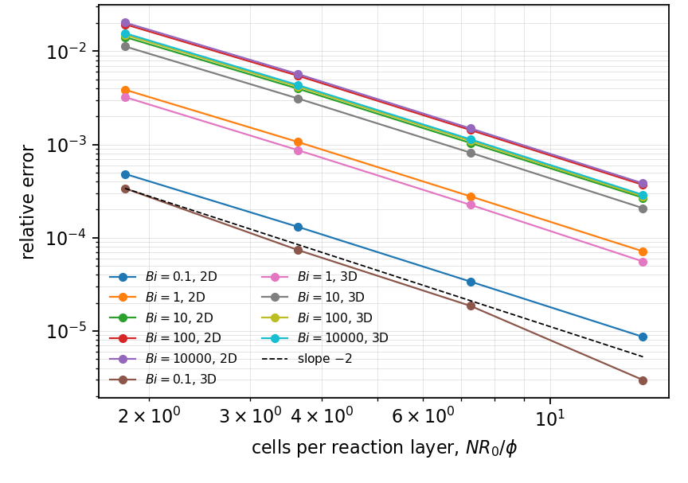
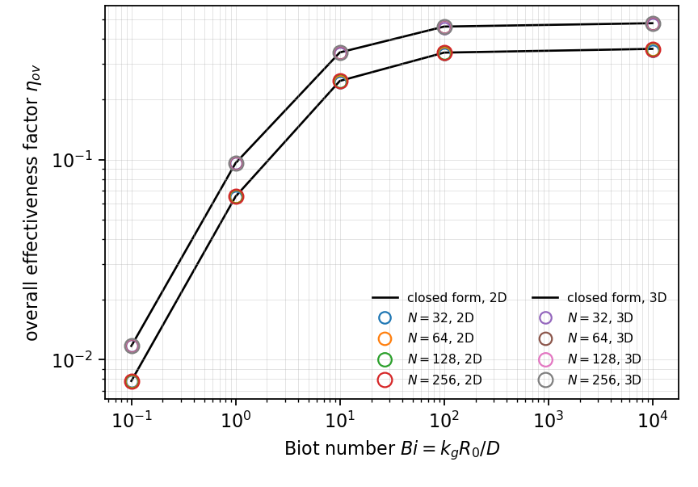

# MT-008 - Catalyst pellet with an external film

## Problem

MT-007's pellet, with the surface concentration no longer imposed: an external
film of mass-transfer coefficient $k_g$ separates the surface from a bulk at
$C_b$.

For $r < R$,

$$
D \nabla^2 C = k C .
$$

$$
k_g\left(C_b - C(R)\right) = D\,\partial_r C(R), \qquad \partial_r C(0) = 0 .
$$

## Parameters

| Parameter | Symbol |
|---|---|
| pellet radius | $R$ |
| diffusivity | $D$ |
| bulk concentration | $C_b$ |
| Thiele modulus | $\phi = R\sqrt{k/D}$ |
| Biot number | $\mathrm{Bi} = k_g R/D$ |

## Reference

$$
\frac{C_s}{C_b} = \frac{1}{1 + \left(\phi \coth \phi - 1\right)/\mathrm{Bi}},
\qquad
\eta_\mathrm{ov} = \frac{\eta(\phi)}{1 + \phi^2 \eta(\phi)/(3\,\mathrm{Bi})},
$$

with $\eta(\phi)$ from MT-007. The limits are MT-007 exactly as
$\mathrm{Bi}\to\infty$, and $\eta_\mathrm{ov} \to 3\,\mathrm{Bi}/\phi^2$ as
$\mathrm{Bi}\to 0$.

The identity $1/\eta_\mathrm{ov} = 1/\eta + \phi^2/(3\,\mathrm{Bi})$ is the
same statement as MT-005's $1/\mathrm{Sh}_\mathrm{ov} = 1/2 + 1/(2\mathrm{Da}_s)$:
resistances in series, measured on the two sides of the interface.

## Report

- $\eta_\mathrm{ov}(\phi,\mathrm{Bi})$ and its relative error,
- the solved surface trace $C_s/C_b$,
- linearity of $1/\eta_\mathrm{ov}$ in $1/\mathrm{Bi}$,
- recovery of MT-007 at large $\mathrm{Bi}$.

## Results

### Two-fluid cut-cell method - L. Libat, C. Selçuk, E. Chénier, V. Le Chenadec

Measured 2026-09-09. Uniform grid, both dimensions. phi = 5, Bi from 0.1 to 1e4.

| | rel. error on eta_ov |
|---|---|
| 3D | 7.4e-5 to 4.3e-3 |
| 2D | 3.4e-5 to 1.5e-3 |

The solved surface concentration stays within 5e-3 of the reference
`1/(1 + (phi coth phi - 1)/Bi)` throughout.

## References

@fogler2016
@froment2011
@sulaiman2019b
