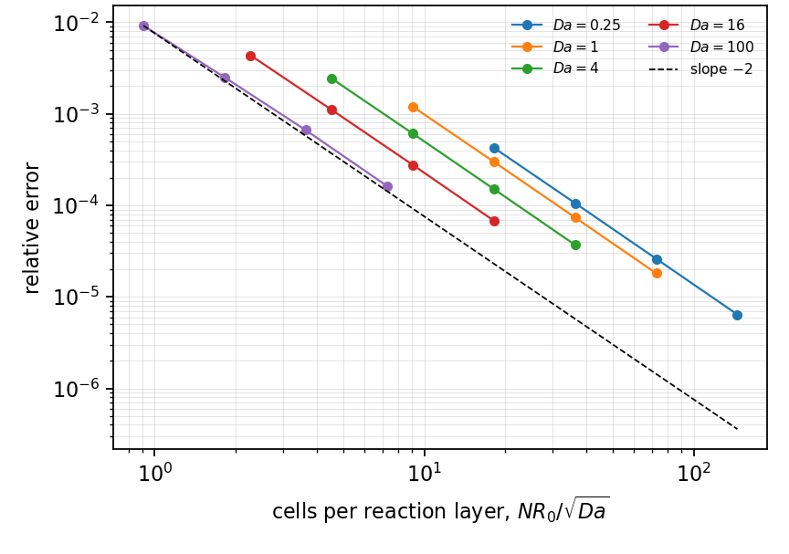
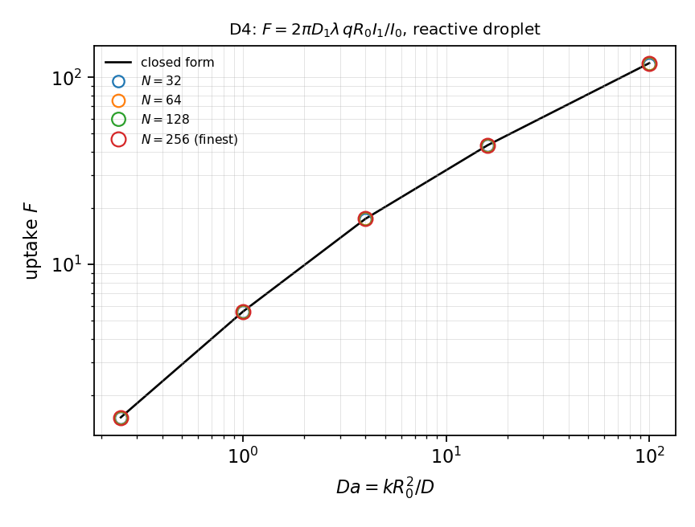

# MT-009 - Reactive absorption into a droplet

## Problem

A droplet of radius $R_0$ occupies $r<R_0$ with diffusivity $D_1$ and consumes the
species at rate $k C$. The exterior phase has diffusivity $D_2$. The
concentrations are related at the interface by a Henry coefficient $H$.

$$
D_1 \nabla^2 C_1 = k C_1 \quad (r<R_0), \qquad
D_2 \nabla^2 C_2 = 0 \quad (r>R_0).
$$

At $r=R_0$ the concentrations satisfy the partition $C_1 = H C_2$ and the
fluxes are continuous. The exterior far field is set to unity.

## Parameters

| Parameter | Symbol |
|---|---|
| droplet radius | $R_0$ |
| interior diffusivity | $D_1$ |
| exterior diffusivity | $D_2$ |
| Henry coefficient | $H$ |
| Damkohler number | $\mathrm{Da} = k R_0^2/D_1$ |

## Reference

With $q = \sqrt{k/D_1}$, so that $qR = \sqrt{\mathrm{Da}}$,

$$
C_1(r) = H\,\frac{I_0(q r)}{I_0(q R_0)},
\qquad
C_2(r) = 1 + \frac{D_1}{D_2}\,H\, q R_0\,
\frac{I_1(qR)}{I_0(qR)} \ln\frac{r}{R},
$$

and the uptake per unit depth is

$$
F = 2\pi D_1 H\, q R_0\, \frac{I_1(qR)}{I_0(qR)} .
$$

## Report

- $F(\mathrm{Da},H)$ and its relative error,
- the interfacial jump $C_1/C_2 - H$ at the interface,
- profiles on both sides at $\mathrm{Da}=4$, $H=2$,
- observed convergence rate.

## Results

### Two-fluid cut-cell method - L. Libat, C. Selçuk, E. Chénier, V. Le Chenadec

Measured 2026-09-09. Uniform grid, N up to 256, 16 MPI ranks. Da and lambda swept independently, lambda up to 100.

6.4e-6 to 1.6e-4, and the interfacial traces reproduce the pair
`(lambda, 1)` to six digits over four decades of `lambda`.

## References

@libat2025st
@Crank1975
