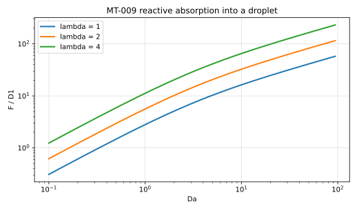

# MT-009 - Reactive absorption into a droplet

## Purpose

The two-phase member of the family: a Henry partition at the interface with a
first-order reaction in the interior phase. It exercises the jump condition and
the interior reaction in one solve, with a closed form for the uptake.

## Physical Configuration

A droplet of radius $R$ occupies $r<R$ with diffusivity $D_1$ and consumes the
species at rate $k C$. The exterior phase has diffusivity $D_2$. The
concentrations are related at the interface by a Henry coefficient $\lambda$.

## Governing Equations

$$
D_1 \nabla^2 C_1 = k C_1 \quad (r<R), \qquad
D_2 \nabla^2 C_2 = 0 \quad (r>R).
$$

## Boundary And Initial Conditions

At $r=R$ the concentrations satisfy the partition $C_1 = \lambda C_2$ and the
fluxes are continuous. The exterior far field is set to unity.

## Material Parameters

| Parameter | Symbol | Value |
|---|---:|---:|
| droplet radius | $R$ | 1 |
| interior diffusivity | $D_1$ | 1 |
| exterior diffusivity | $D_2$ | 1 |
| Henry coefficient | $\lambda$ | 1, 2, 4 |
| Damkohler number | $\mathrm{Da} = k R^2/D_1$ | 0.25 to 64 |

## Reference Solution

With $q = \sqrt{k/D_1}$, so that $qR = \sqrt{\mathrm{Da}}$,

$$
C_1(r) = \lambda\,\frac{I_0(q r)}{I_0(q R)},
\qquad
C_2(r) = 1 + \frac{D_1}{D_2}\,\lambda\, q R\,
\frac{I_1(qR)}{I_0(qR)} \ln\frac{r}{R},
$$

and the uptake per unit depth is

$$
F = 2\pi D_1 \lambda\, q R\, \frac{I_1(qR)}{I_0(qR)} .
$$

## Recommended Numerical Setup

The exterior field is logarithmic, so the exterior boundary value depends on
the box size: impose the reference $C_2$ on the outer boundary rather than a
constant. Sweep $\mathrm{Da}$ at fixed $\lambda$ and then $\lambda$ at fixed
$\mathrm{Da}$.

## Quantities To Report

- $F(\mathrm{Da},\lambda)$ and its relative error,
- the interfacial jump $C_1/C_2 - \lambda$ at the interface,
- profiles on both sides at $\mathrm{Da}=4$, $\lambda=2$,
- observed convergence rate.

## Known Difficulties

- imposing a constant exterior far field, which is inconsistent with the
  logarithmic solution,
- the direction of the partition, $C_1 = \lambda C_2$ against its inverse,
- flux continuity written with the wrong diffusivity on one side.

## References

@libat2025st
@Crank1975
