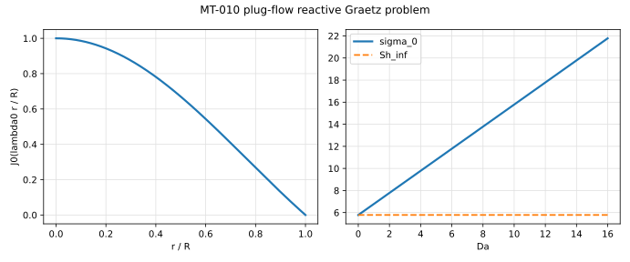

# MT-010 - Plug-flow reactive channel

## Problem

Plug flow $U\hat{\mathbf{x}}$ between plane walls a distance $W$ apart, both
held at $C=0$, with a first-order bulk reaction. The full two-dimensional
equation is solved, with no boundary-layer approximation and no entrance-length
assumption:

$$
U \partial_x C = D\left(\partial_x^2 C + \partial_y^2 C\right) - k C .
$$

$$
C(x, \pm W/2) = 0 .
$$

## Parameters

Taking $W=1$ and $D=1$, so that $\mathrm{Pe}=U$ and $\mathrm{Da}=k$.

| Parameter | Symbol | Value |
|---|---:|---:|
| wall spacing | $W$ | 1 |
| diffusivity | $D$ | 1 |
| Peclet number | $\mathrm{Pe} = UW/D$ | 5 |
| Damkohler number | $\mathrm{Da} = kW^2/D$ | 0, 1, 10, 100 |

## Reference

With $q = \pi/W$, the field

$$
C(x,y) = \cos\!\left(q y\right) e^{-\mu x}
$$

is an exact solution of the full two-dimensional problem, where $\mu$ is the
positive root of

$$
D\mu^2 + U\mu - \left(k + D q^2\right) = 0,
\qquad
\mu = \frac{-U + \sqrt{U^2 + 4D\left(k + Dq^2\right)}}{2D} .
$$

The reaction enters only through the constant term, so it shifts the axial
decay rate without touching the transverse structure. The often-quoted shift
$\mu - \mu(0) = k/U$ is the large-Peclet limit of this root, not its value:
at $\mathrm{Pe}=5$ the two differ by a factor of about three, and the quadratic
root is what should be gated.

The Sherwood number built on the transverse profile is unchanged by the
reaction in the same limit, so its drift with $\mathrm{Da}$ measures how much
reaction is leaking into the convective flux.

## Report

- $\mu$ at each $\mathrm{Da}$, against the quadratic root,
- the drift of $\mathrm{Sh}$ with $\mathrm{Da}$, which should be small,
- the transverse profile against $\cos(qy)$,
- observed convergence rate.

## Results

Measured with the `basilisk-libat` cut-cell solver, 2026-09-09.

Pe = 5, N = 128 uniform, 16 ranks.

| Da | 0 | 1 | 10 | 100 |
|---|---|---|---|---|
| rel. error on mu | 6.3e-4 | 6.2e-4 | 6.5e-4 | 1.1e-3 |
| Sh | 9.8270 | 9.8250 | 9.8061 | 9.6768 |

The decay rate converges at order about 1.86 and the reaction does not leak
into the convective flux: Sh drifts 1.5% over four decades of Da.

**Gate not met.** The Sherwood number itself converges at order 1.03, not 2:
the corner where the wall meets the interface is first order in this solver.

## References

@shah1978
@higuera2023
