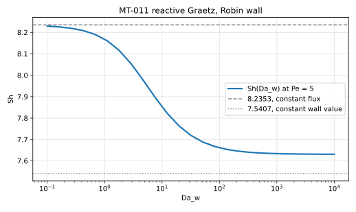
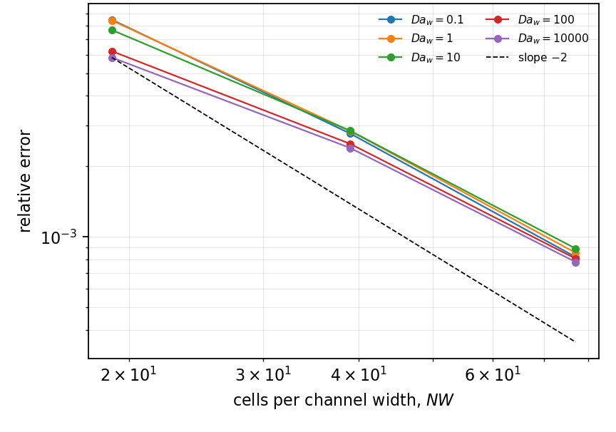
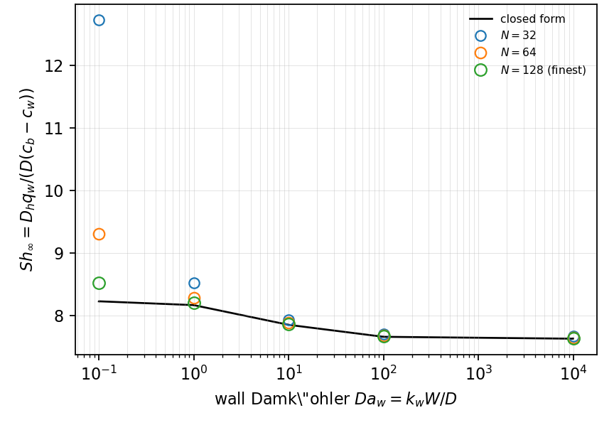

# MT-011 - Reactive Graetz problem with a reacting wall

## Problem

Plane Poiseuille flow between walls a distance $W$ apart consumes the species
at the wall by a first-order surface reaction.

$$
u(y)\,\partial_x C = D\left(\partial_x^2 C + \partial_y^2 C\right),
\qquad
u(y) = \frac{3}{2}\bar{u}\left(1 - \left(\frac{2y}{W}\right)^2\right) .
$$

At each wall,

$$
-D\,\partial_n C = k_s C ,
$$

with symmetry on the centreline. The axial diffusion term is kept.

## Parameters

| Parameter | Symbol |
|---|---|
| channel width | $W$ |
| hydraulic diameter | $D_h = 2W$ |
| mean velocity | $\bar{u}$ |
| diffusivity | $D$ |
| Peclet number | $\mathrm{Pe} = \bar{u}W/D$ |
| wall Damkohler number | $\mathrm{Da}_w = k_s W/D$ |

## Reference

Separating $C = Y(y)e^{-\mu x}$ and keeping the axial diffusion leaves an
eigenvalue problem on the half-channel,

$$
Y'' + \left(\mu^2 + \frac{\mu\,u(y)}{D}\right) Y = 0,
\qquad
Y'(0) = 0,
\qquad
D\,Y'(W/2) + k_s Y(W/2) = 0 ,
$$

whose smallest positive root $\mu$ gives an exact solution of the full
two-dimensional problem. The transfer coefficient follows from the same
eigenfunction,

$$
\mathrm{Sh} = \frac{D_h\,q_w}{D\,(C_b - C_w)},
\qquad
C_b = \frac{\int u Y}{\int u} .
$$

As $\mathrm{Pe}\to\infty$ the two limits are the tabulated parallel-plate
values $8.2353$ at $\mathrm{Da}_w\to 0$ and $7.5407$ at
$\mathrm{Da}_w\to\infty$: the wall kinetics move $\mathrm{Sh}$ *down*, from the
constant-flux value to the constant-wall-value one.

## Report

- $\mathrm{Sh}(\mathrm{Da}_w)$ and its relative error,
- the decay rate $\mu$,
- the two limits above, reached at large $\mathrm{Pe}$,
- observed convergence rate.

Both observables are differences of nearly equal numbers when the wall reacts
weakly. Report the conditioned error, $\mathrm{Sh}$ divided by the
amplification $C_b/(C_b - C_w)$, and say that you did.

## Results

### Two-fluid cut-cell method - L. Libat, C. Selçuk, E. Chénier, V. Le Chenadec

Measured 2026-09-10. Uniform grid, N = 32/64/128, 16 MPI ranks, Pe = 5. The
eigensolve used as the reference reproduces 8.2353 and 7.5407 to 1e-6 at large
Peclet number. Errors are conditioned; the raw spread of 45 across the sweep
collapses to one number.

| Da_w | 0.1 | 1 | 10 | 100 | 1e4 |
|---|---|---|---|---|---|
| Sh at N = 128 | 8.524 | 8.204 | 7.863 | 7.668 | 7.637 |
| rel. error | 8.2e-4 | 8.5e-4 | 8.9e-4 | 8.1e-4 | 7.8e-4 |
| order | 1.75 | 1.73 | 1.67 | 1.63 | 1.62 |

The order is 1.6 to 1.8 where the same geometry with a plug profile reaches
2.00. Neither the Robin row nor the velocity sampling point accounts for it:
at $\mathrm{Da}_w = 10^4$ the wall is Dirichlet to four decimals and the order
is the worst of the sweep, and sampling the velocity at the wet-face centroid
moves it not at all. The parabolic profile itself is the remaining candidate.

## References

@shah1978
@higuera2023
