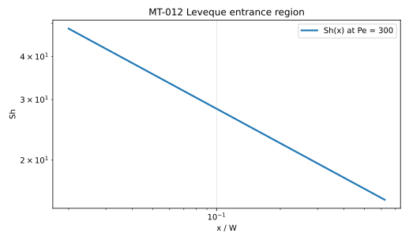
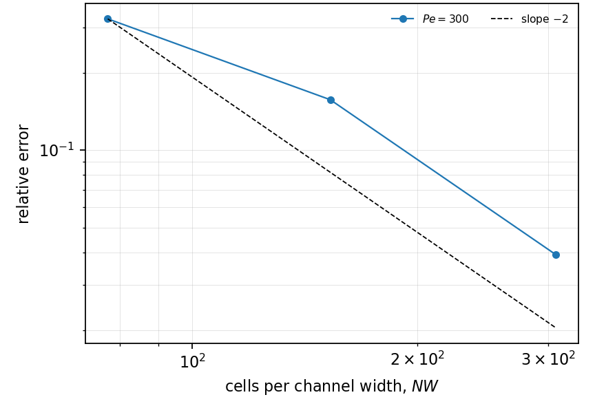

# MT-012 - Leveque entrance region in a channel

## Problem

A uniform stream enters a channel whose walls are held at $C = 0$. Near the
entrance the concentration layer is thin, sees only the wall shear rate, and
grows like $x^{1/3}$.

$$
u(y)\,\partial_x C = D\,\partial_y^2 C,
\qquad
C(x, \pm W/2) = 0,
\qquad
C(0, y) = C_0 .
$$

## Parameters

| Parameter | Symbol |
|---|---|
| channel width | $W$ |
| hydraulic diameter | $D_h = 2W$ |
| mean velocity | $\bar{u}$ |
| wall shear rate | $\dot\gamma = 6\bar{u}/W$ |
| diffusivity | $D$ |
| Peclet number | $\mathrm{Pe} = \bar{u}W/D$ |

## Reference

While the layer is thin against $W$,

$$
\mathrm{Sh}_x = \frac{D_h}{\Gamma(4/3)}
\left(\frac{\dot\gamma}{9 D x}\right)^{1/3} ,
$$

so a log-log fit of the local transfer coefficient against $x$ has prefactor
$D_h\,(\dot\gamma/9D)^{1/3}/\Gamma(4/3)$ and exponent $-1/3$. The two are not
equally easy to measure: the prefactor is an amplitude, the exponent is a slope
that competes with the $O(\delta/W)$ correction still present in any affordable
window.

## Report

- the fitted prefactor against the closed form,
- the fitted exponent against $-1/3$,
- the fit window, fixed in $x$ and not keyed on the layer thickness,
- observed convergence rate of the prefactor.

## Results

### Two-fluid cut-cell method - L. Libat, C. Selçuk, E. Chénier, V. Le Chenadec

Measured 2026-09-10. Uniform grid, N = 128/256/512, 16 MPI ranks, Pe = 300, fit
window $x/L_0 \in [0.05, 0.15]$. The prefactor is normalised by its exact value.

| N | 128 | 256 | 512 |
|---|---|---|---|
| prefactor | 0.676 | 0.843 | 0.961 |
| exponent | -0.585 | -0.509 | -0.457 |
| order on the prefactor | | 1.04 | 2.00 |

The prefactor converges at second order and lands within 3.9%. The exponent
does not converge: -0.457 against -1/3, improving at about half an order. Half
a decade of window has not the lever arm to separate the power from its
correction, and widening it wants a larger Peclet number, which wants a finer
mesh to hold the cell Peclet number down. This case is reported, not gated, on
the exponent.

## References

@leveque1928
@shah1978
