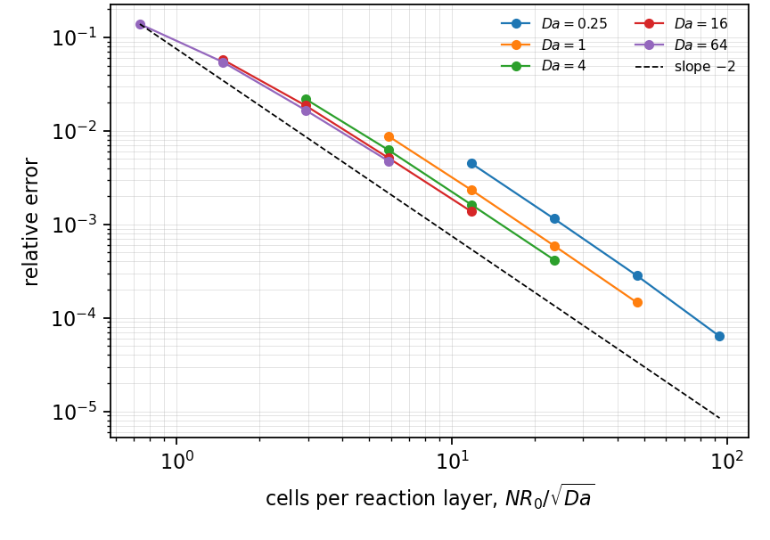
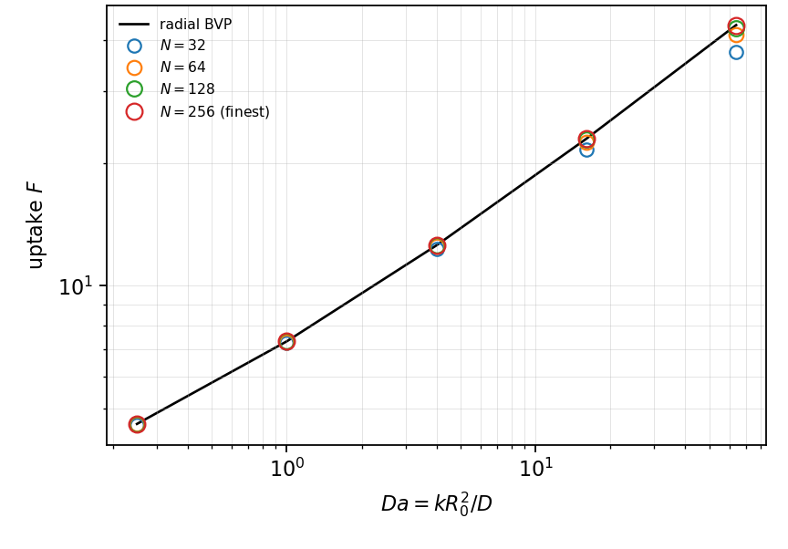
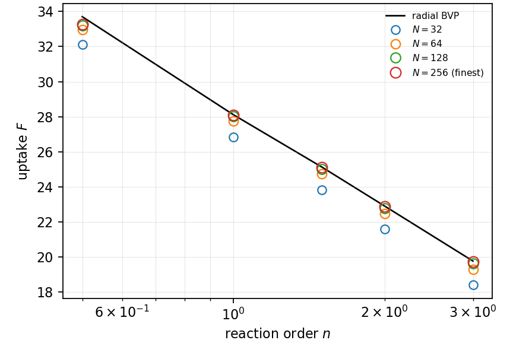
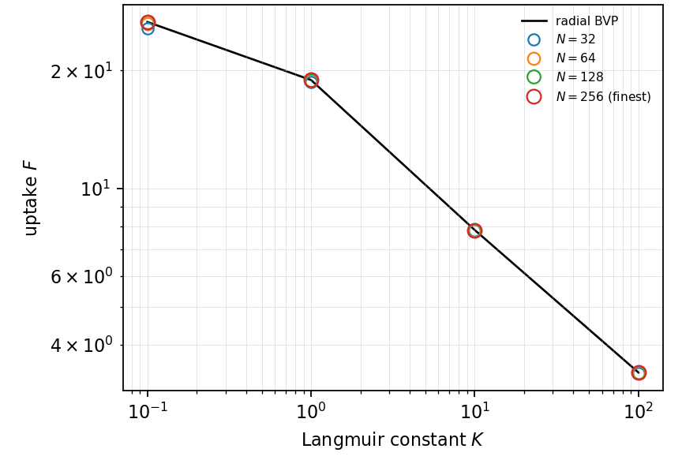

# MT-013 - Nonlinear kinetics outside a disk

## Problem

The steady field outside a disk of radius $R_0$ held at $C_s$ is consumed by a
rate that is not linear in the concentration.

$$
D \nabla^2 C = k\,f(C), \qquad r > R_0,
$$

with $C(R_0) = C_s$ and the far field imposed on the box. Two families:

$$
f(C) = C^n
\qquad\text{and}\qquad
f(C) = \frac{C}{1 + K C} ,
$$

the second a Langmuir-Hinshelwood rate, whose volumetric maximum $k/4K$ is
attained inside the domain whenever $1/K$ is.

## Parameters

| Parameter | Symbol |
|---|---|
| disk radius | $R_0$ |
| diffusivity | $D$ |
| surface concentration | $C_s$ |
| Damkohler number | $\mathrm{Da} = k R_0^2/D$ |
| reaction order | $n$ |
| adsorption constant | $K$ |

## Reference

There is no closed form. The reference is the radial two-point boundary-value
problem

$$
\frac{1}{r}\frac{d}{dr}\left(r\frac{dC}{dr}\right) = \frac{k}{D} f(C),
\qquad
C(R_0) = C_s ,
$$

integrated on a fine uniform grid with the same far-field datum as the run. At
$n = 1$ it must reproduce $F = 2\pi R_0\sqrt{\mathrm{Da}}\,K_1/K_0$, which is what
makes the nonlinear rows mean anything.

Below $n = 1$ the concentration reaches exactly zero at a finite radius and the
problem has a free boundary; a solver that floors the iterate rather than
tracking the front stalls at its cap. That is a property of the problem, not of
the discretisation, and it should be reported rather than gated.

## Report

- the uptake $F$ against the radial solve, over $\mathrm{Da}$ and over $n$,
- the Langmuir-Hinshelwood rate maximum $k/4K$, where it is attained inside
  the box,
- agreement between the interface flux and the volume integral of the rate,
  which detects a front the iterate has walked past,
- observed convergence rate.

## Results

### Two-fluid cut-cell method - L. Libat, C. Selçuk, E. Chénier, V. Le Chenadec

Measured 2026-09-08. Uniform grid, N = 32 to 256, 64 MPI ranks. Relative error
at N = 256.

Second-order kinetics, $\mathrm{Da}$ sweep:

| Da | 0.25 | 1 | 4 | 16 | 64 |
|---|---|---|---|---|---|
| rel. error | 6.3e-5 | 1.5e-4 | 4.2e-4 | 1.4e-3 | 4.8e-3 |

Order sweep at Da = 16:

| n | 0.5 | 1 | 1.5 | 2 | 3 |
|---|---|---|---|---|---|
| rel. error | 1.3e-2 | 9.2e-4 | 1.1e-3 | 1.4e-3 | 1.8e-3 |

Langmuir-Hinshelwood at Da = 16:

| K | 0.1 | 1 | 10 | 100 |
|---|---|---|---|---|
| rel. error | 7.2e-4 | 1.9e-4 | 3.5e-5 | 4.2e-5 |

Second order over $\mathrm{Da} \in [0.25, 64]$ and $n \in [1, 3]$, with the
rate maximum $k/4K$ hit to 1.0e-11. The $n = 1/2$ column is the free boundary:
its error is 1.5e-2 at N = 128 and 1.3e-2 at N = 256, i.e. it does not converge,
and the iterate goes negative by as much as -1.9e-1 as the mesh resolves the
front better. It is reported and exempted, not gated.

## References

@frankkamenetskii1969
@aris1975
@froment2011
