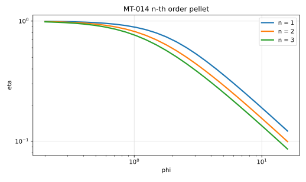
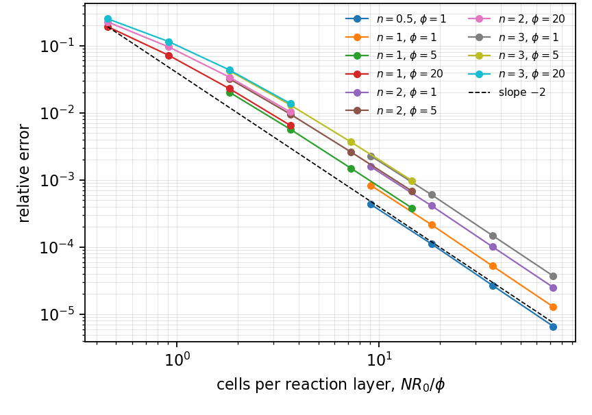
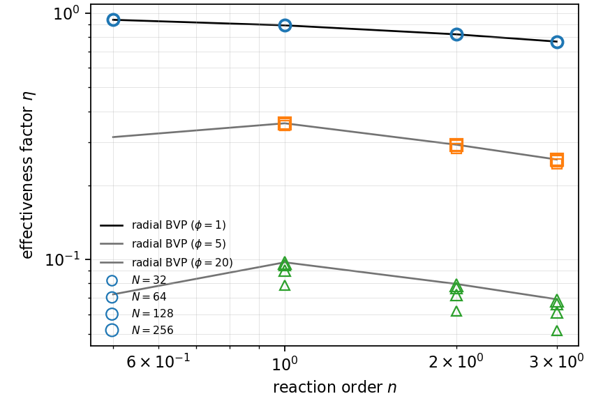

# MT-014 - n-th order pellet and the generalized Thiele modulus

## Problem

A pellet of radius $R$ holds its surface at $C_s$ and consumes the species
internally at rate $k C^n$.

$$
D \nabla^2 C = k\,C^n, \qquad r < R,
$$

with $C(R) = C_s$ and $\partial_r C(0) = 0$.

## Parameters

| Parameter | Symbol |
|---|---|
| pellet radius | $R$ |
| diffusivity | $D$ |
| surface concentration | $C_s$ |
| Thiele modulus | $\phi = R\sqrt{k C_s^{n-1}/D}$ |
| reaction order | $n$ |
| generalized modulus | $\Phi = \phi\sqrt{(n+1)/2}$ |

## Reference

In the scaled radius $x = r/R$ and $y = C/C_s$,

$$
y'' + \frac{s}{x}y' = \phi^2 y^n,
\qquad
y(1) = 1,
\qquad
y'(0) = 0 ,
$$

with $s = 1$ for a disk and $2$ for a sphere, and

$$
\eta = \frac{(s+1)\,y'(1)}{\phi^2} .
$$

At $n = 1$ this returns $\eta = 2I_1(\phi)/(\phi I_0(\phi))$. Aris' generalized
modulus $\Phi$ collapses the curves for different $n$ onto one asymptote:
$\eta\Phi \to 2$ for a disk, $1$ for a slab. Fix one convention and say which.

For $n < 1$ the concentration reaches zero at a finite radius and the pellet
grows a dead core. The asymptote then loses the geometry factor it is being
compared against, since the reaction occupies an annulus rather than the disk.

## Report

- $\eta(\phi, n)$ against the radial solve,
- the collapse $\eta\Phi$ against its asymptote,
- the centre value, which says whether a dead core has formed,
- agreement between $\eta$ from the interface flux and $\eta$ from the volume
  average, which is the cheapest dead-core detector,
- observed convergence rate.

## Results

### Two-fluid cut-cell method - L. Libat, C. Selçuk, E. Chénier, V. Le Chenadec

Measured 2026-09-08. Uniform grid, N = 32 to 256, 64 MPI ranks, disk.
Relative error at N = 256.

| n | 0.5 | 1 | 2 | 3 |
|---|---|---|---|---|
| phi = 1 | 6.6e-6 | 1.3e-5 | 2.5e-5 | 3.7e-5 |
| phi = 5 | dead core | 3.8e-4 | 6.8e-4 | 9.8e-4 |
| phi = 20 | dead core | 6.5e-3 | 1.0e-2 | 1.4e-2 |

Orders are 1.92 to 2.04 at $\phi = 1$. The collapse $\eta\Phi$ reaches 1.9493,
1.9504 and 1.9523 at $n = 1, 2, 3$ against the disk asymptote of 2.

The two dead-core entries are exempted rather than gated: at $n = 1/2$ and
$\phi \ge 5$ the centre reaches zero, the measured $\eta\Phi$ is 1.2517 instead
of 1.95, and the two routes to $\eta$ disagree by 8e-2 where they agree to
1e-12 everywhere else. At $\phi = 1$, $n = 1/2$ the centre value is 0.773 and
the case is clean, so it is the dead core and not the order that decides it.

## References

@aris1975
@thiele1939
