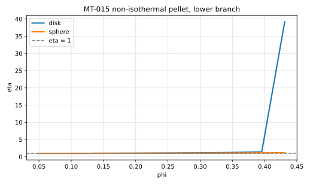
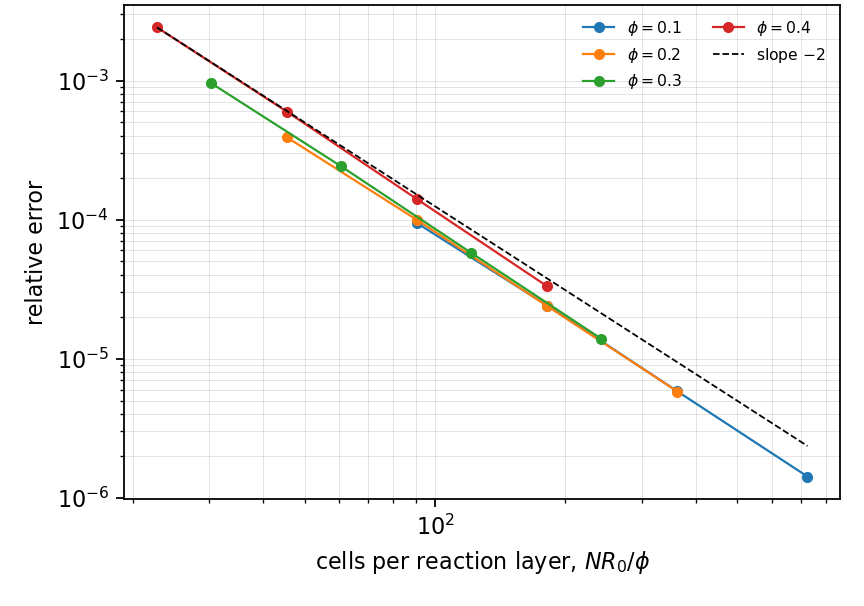
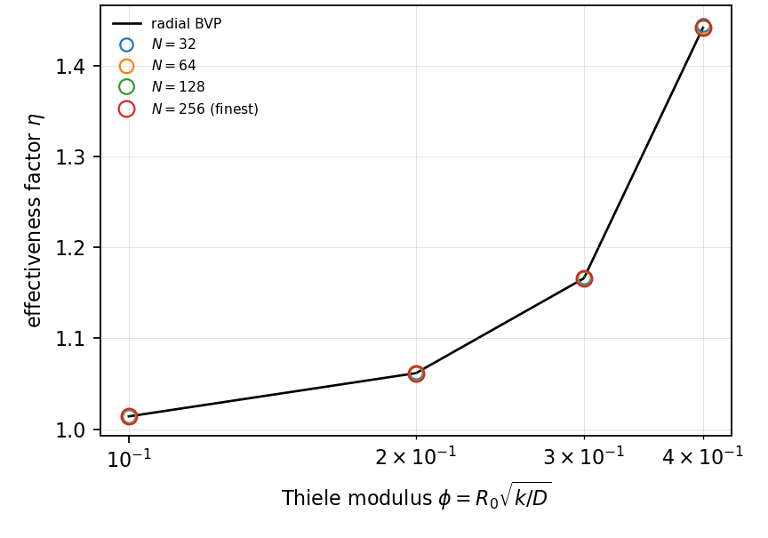

# MT-015 - Non-isothermal pellet, Weisz-Hicks

## Problem

The pellet of MT-014 releases heat as it reacts. Eliminating the temperature
through the Prater relation leaves one equation for the scaled concentration
$y = C/C_s$ with an Arrhenius rate,

$$
y'' + \frac{s}{x}y' =
\phi^2 y \exp\!\left(\frac{\gamma\beta(1-y)}{1 + \beta(1-y)}\right),
\qquad
y(1) = 1,
\qquad
y'(0) = 0 ,
$$

with $s = 1$ for a disk and $2$ for a sphere.

## Parameters

| Parameter | Symbol |
|---|---|
| Thiele modulus | $\phi$ |
| Prater number | $\beta = (-\Delta H) D C_s/(\lambda T_s)$ |
| Arrhenius group | $\gamma = E/(R_g T_s)$ |
| geometry factor | $s$ |

## Reference

The same radial two-point problem as MT-014 with the Arrhenius rate, solved by
shooting on the centre value. An exothermic pellet, $\beta > 0$, releases heat
faster than it can conduct it away, so the interior runs hotter than the
surface and

$$
\eta = \frac{(s+1)\,y'(1)}{\phi^2} > 1 .
$$

For large $\gamma\beta$ the curve $\eta(\phi)$ is S-shaped and carries up to
three steady states with ignition and extinction turning points; the
multiplicity count against the geometry factor is the validation target. Past
the turning point the lower branch does not exist, and a solver that shoots for
it has nowhere to go. Following the branch through the fold needs an arclength
continuation, which is a different piece of work.

## Report

- $\eta(\phi)$ on the lower branch against the radial solve,
- that $\eta > 1$, and by how much,
- where the branch ends,
- observed convergence rate.

## Results

### Two-fluid cut-cell method - L. Libat, C. Selçuk, E. Chénier, V. Le Chenadec

Measured 2026-09-08. Uniform grid, N = 32 to 256, 64 MPI ranks, $\beta = 0.6$,
$\gamma = 20$, lower branch. Relative error at N = 256.

| phi | 0.1 | 0.2 | 0.3 | 0.4 |
|---|---|---|---|---|
| eta, disk | 1.014 | 1.062 | 1.166 | 1.442 |
| eta, sphere | 1.008 | 1.031 | 1.077 | 1.160 |
| rel. error, disk | 1.4e-6 | 5.8e-6 | 1.4e-5 | 3.3e-5 |

The effectiveness factor exceeds one, which is the point of the case, and it is
recovered to 1e-4 to 2e-3 already at N = 32.

The sweep stops at $\phi = 0.4$ and the case says why rather than reporting a
failure: **the lower branch ends between $\phi = 0.4$ and $\phi = 0.6$**, and
past the turning point there is no lower solution to shoot for. The S-curve
itself is not measured here.

## References

@weisz1962
@villadsen1978
@aris1975
