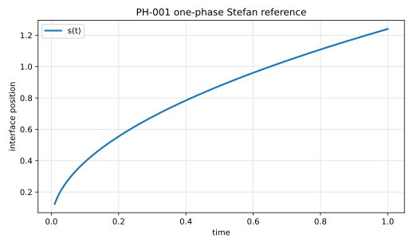

# PH-001 - Planar one-phase Stefan problem

## Problem

A semi-infinite material initially at the phase-change temperature is heated
from one side. A liquid layer grows from the heated wall and is separated from
the solid by a moving planar interface.

```text
x = 0                        x = s(t)
| heated wall | liquid phase | interface | solid at T_m |
```

The active phase is the liquid phase. The solid phase remains at the
phase-change temperature and does not solve a heat equation.

In the liquid phase, $0 < x < s(t)$,

$$
\rho c_p \partial_t T = \partial_x(\kappa \partial_x T).
$$

At the moving interface,

$$
T(s(t),t) = T_m.
$$

The Stefan condition is

$$
\rho L \frac{ds}{dt}
=
-\kappa \partial_x T(s(t)^-,t).
$$

This sign convention assumes that the liquid occupies $0 < x < s(t)$ and that
the interface moves toward positive $x$ during melting.

At the heated wall,

$$
T(0,t) = T_h, \qquad T_h > T_m.
$$

At the interface,

$$
T(s(t),t) = T_m.
$$

The similarity solution starts from

$$
s(0)=0.
$$

For numerical computations, initialize at a small nonzero time $t_0$ using the
reference solution to avoid the singular gradient at $t=0$.

## Parameters

| Parameter | Symbol |
|---|---|
| density | $\rho$ |
| heat capacity | $c_p$ |
| thermal conductivity | $\kappa$ |
| thermal diffusivity | $\alpha=\kappa/(\rho c_p)$ |
| melting temperature | $T_m$ |
| hot-wall temperature | $T_h$ |
| Stefan number | $\mathrm{Ste}=c_p(T_h-T_m)/L$ |
| latent heat | $L$ |

## Reference

The exact similarity solution is

$$
s(t) = 2\lambda\sqrt{\alpha t},
$$

and

$$
T(x,t)
=
T_h
-
(T_h-T_m)
\frac{
\operatorname{erf}\left(x/(2\sqrt{\alpha t})\right)
}{
\operatorname{erf}(\lambda)
}.
$$

The parameter $\lambda$ is determined from

$$
\mathrm{Ste}
=
\sqrt{\pi}\lambda \exp(\lambda^2)\operatorname{erf}(\lambda).
$$

For the recommended case $\mathrm{Ste}=1$,

$$
\lambda = 0.620062633313595,
$$

so

$$
s(t) = 1.24012526662719\sqrt{t}.
$$

The file `data/PH-001/reference.csv` tabulates $s(t)$ and $T(x,t)$ for selected
times and normalized positions $\chi=x/s(t)$.



## Report

- interface position $s_h(t)$ at every output time,
- absolute interface error $|s_h(t)-s(t)|$,
- temperature profiles at $t=0.1$, $0.4$, and $1.0$,
- global latent plus sensible energy balance,
- observed convergence rate under grid refinement.

## References

@AlexiadesSolomon1993
@Crank1975
