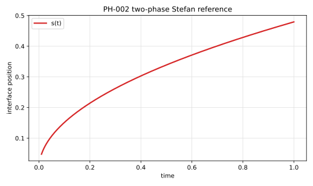

# PH-002 - Planar two-phase Stefan problem

## Problem

A planar interface separates two phases in a one-dimensional infinite-domain
similarity problem.

```text
phase -                         phase +
x < s(t)                        x > s(t)

T_-inf > T_m                    T_+inf < T_m
hot side                        cold side
```

The normal direction is chosen from phase $-$ to phase $+$:

$$
\mathbf n = \mathbf e_x.
$$

For a finite-domain numerical test, the computational domain must be large
enough that outer boundaries do not influence the solution over the simulated
time interval.

In each phase $\Omega_i(t)$, $i\in\{-,+\}$,

$$
\rho_i c_{p,i}\partial_t T_i
=
\partial_x(k_i\partial_x T_i),
$$

with

$$
\alpha_i = \frac{k_i}{\rho_i c_{p,i}}.
$$

At the interface,

$$
T_-(s(t),t)=T_+(s(t),t)=T_m.
$$

With the present normal convention, the Stefan condition is

$$
\rho L \frac{ds}{dt}
=
k_+\partial_xT_+(s(t)^+,t)
-
k_-\partial_xT_-(s(t)^-,t).
$$

The analytical solution uses far-field conditions

$$
T_-(x,t)\to T_{-\infty}\quad\text{as }x\to-\infty,
$$

and

$$
T_+(x,t)\to T_{+\infty}\quad\text{as }x\to+\infty,
$$

with $T_{-\infty}>T_m$ and $T_{+\infty}<T_m$.

Initialize a finite-domain simulation at $t_0>0$ from the analytical solution:

$$
s(t_0)=2\xi\sqrt{t_0}.
$$

## Parameters
| Parameter | Symbol |
|---|---|
| density | $\rho$ |
| heat capacity | $c_p$ |
| conductivity | $k$ |
| thermal diffusivity | $\alpha=k/(\rho c_p)$ |
| far-field temperatures | $T_{-\infty}$, $T_{+\infty}$ |
| melting temperature | $T_m$ |
| latent heat | $L$ |

Each property is defined separately in the two phases. The far-field
temperatures must not be symmetric about $T_m$, or the two heat fluxes cancel
and the front does not move.

## Reference

The interface position is

$$
s(t)=2\xi\sqrt{t}.
$$

Define

$$
\lambda_-=\frac{\xi}{\sqrt{\alpha_-}},
\qquad
\lambda_+=\frac{\xi}{\sqrt{\alpha_+}}.
$$

For $x<s(t)$,

$$
T_-(x,t)
=
T_{-\infty}
+
(T_m-T_{-\infty})
\frac{
1+\operatorname{erf}\left(x/(2\sqrt{\alpha_-t})\right)
}{
1+\operatorname{erf}(\lambda_-)
}.
$$

For $x>s(t)$,

$$
T_+(x,t)
=
T_{+\infty}
+
(T_m-T_{+\infty})
\frac{
\operatorname{erfc}\left(x/(2\sqrt{\alpha_+t})\right)
}{
\operatorname{erfc}(\lambda_+)
}.
$$

The scalar equation for $\xi$ is

$$
\rho L\xi
=
\frac{
k_-(T_{-\infty}-T_m)
}{
\sqrt{\pi\alpha_-}\left[1+\operatorname{erf}(\lambda_-)\right]
}
\exp(-\lambda_-^2)
-
\frac{
k_+(T_m-T_{+\infty})
}{
\sqrt{\pi\alpha_+}\operatorname{erfc}(\lambda_+)
}
\exp(-\lambda_+^2).
$$

For the recommended dimensionless case,

$$
\xi = 0.239694222804215,
$$

and therefore

$$
s(t)=0.47938844560843\sqrt{t}.
$$

The file `data/PH-002/reference.csv` tabulates $s(t)$ and $T(x,t)$ for selected
times and normalized coordinates.



## Report

- interface position $s_h(t)$,
- one-sided heat fluxes at the interface,
- Stefan residual using the reported heat fluxes,
- temperature profiles at $t=0.1$, $0.4$, and $1.0$,
- global energy balance,
- convergence rates for $s(t)$ and $T(x,t)$.

## References

@AlexiadesSolomon1993
@Crank1975
