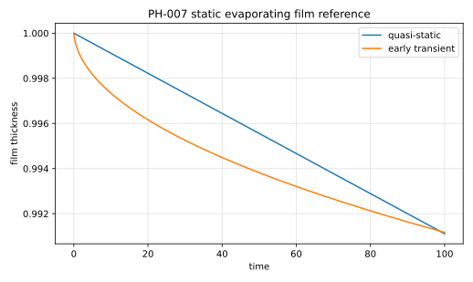

# PH-007 - Static evaporating film

## Problem

A liquid film initially occupies $0\le y\le h_0$. Vapor fills the region
$h(t)<y<L$. The concentration is fixed at the interface and at the top boundary.

```text
y = 0                 y = h(t)                     y = L
wall | liquid film | evaporating interface | vapor | C = C_inf
```

In the vapor phase,

$$
\partial_t C = D\partial_{yy}c.
$$

The quasi-static concentration profile is

$$
C(y,t)
=
C_s-\frac{C_s-C_\infty}{L-h(t)}(y-h(t)).
$$

The film recession speed is approximated by

$$
\frac{dh}{dt}
\approx
-\mu\frac{D}{L},
\qquad
\mu=\frac{C_s-C_\infty}{\rho}.
$$

## Parameters

| Parameter | Symbol |
|---|---|
| domain height | $L$ |
| initial film thickness | $h_0$ |
| diffusivity | $D$ |
| interfacial concentration | $C_s$ |
| far concentration | $C_\infty$ |
| concentration-density ratio | $\mu$ |

## Reference

The open-box quasi-static model is

$$
h_\mathrm{qs}(t)=h_0-\mu\frac{D}{L-h_0}t.
$$

The early transient half-space approximation is

$$
h_\infty(t)
\approx
h_0
+2\mu\left[
\sqrt{\frac{t_s}{\pi}}
-
\sqrt{\frac{t+t_s}{\pi}}
\right],
$$

with $t_s=0.05$ matching the time offset used in the Basilisk test.

The file `data/PH-007/reference.csv` tabulates the film thickness and recession
speed predicted by these formulas.



Generate the CSV and figure with:

```bash
python3 scripts/plot_reference_figures.py PH-007
```

## Report

- mean film thickness $h(t)$,
- interface recession velocity,
- vapor concentration profile,
- time at which the concentration profile becomes close to linear.

## References

@BasiliskQMagdelaineStaticFilm
