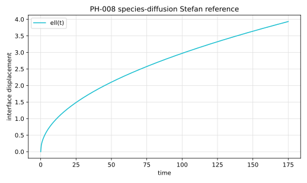

# PH-008 - Species-diffusion Stefan problem

## Problem

A planar gas-liquid interface releases gas into an initially gas-free liquid.
The concentration at the interface is fixed by Henry's law.

The liquid concentration satisfies

$$
\partial_t c = D\partial_{yy}c.
$$

The interface displacement is

$$
\ell(t)=\frac{2}{He}\sqrt{\frac{Dt}{\pi}}.
$$

The concentration field is

$$
c(y,t)
=
c_\Sigma
\left[
1-\operatorname{erf}
\left(
\frac{y-y_\Sigma(t)}{2\sqrt{Dt}}
\right)
\right].
$$

## Parameters

| Parameter | Symbol |
|---|---|
| Schmidt number | $Sc$ |
| diffusivity | $D$ |
| Henry coefficient | $He$ |
| interface concentration scale | $c_\Sigma$ |
| final time | $t_{end}$ |

## Reference

For the recommended case,

$$
\ell(t)=\frac{2}{1.2}\sqrt{\frac{0.1t}{\pi}}.
$$

The file `data/PH-008/reference.csv` tabulates the displacement and
concentration profile.



Generate the CSV and figure with:

```bash
python3 scripts/plot_reference_figures.py PH-008
```

## Report

- interface displacement $\ell_h(t)$,
- gas volume change,
- concentration profile,
- final displacement error.

## References

@Gennari2022
@BasiliskGennariSpeciesStefan
