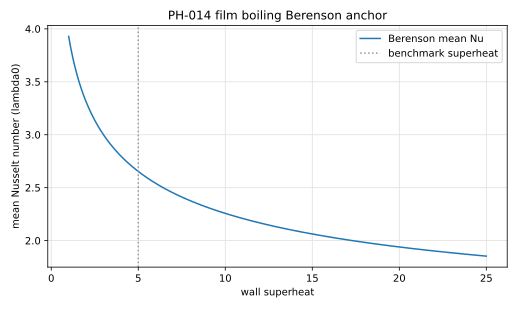

# PH-014 - Film boiling on a horizontal wall

## Problem

A two-dimensional periodic strip of width $\lambda_d$ (the most dangerous
Taylor wavelength) contains a vapor layer on a horizontal superheated wall
below saturated liquid. The initial interface is a small single-mode
perturbation of the flat film:

$$
y_\Gamma(x)
=
\frac{\lambda_d}{128}
\left[
4 + \cos\!\left(\frac{2\pi x}{\lambda_d}\right)
\right],
\qquad
\lambda_d = 2\pi\sqrt{\frac{3\,\sigma}{g\,(\rho_l-\rho_v)}} .
$$

The wall is isothermal at $T_{sat}+\Delta T$; the liquid and interface are at
$T_{sat}$. Side boundaries are periodic; the top is an outflow far from the
film (domain height $\geq 3\lambda_d$).

Incompressible Navier-Stokes in both phases with surface tension and gravity;
energy equation with the interface held at $T_{sat}$; interfacial mass flux
from the conductive jump

$$
\dot m''
=
\frac{\big[\![\,k\,\nabla T\cdot\mathbf n\,]\!\big]}{h_{fg}},
$$

which drives the velocity jump $[\![\mathbf u\cdot\mathbf n]\!] =
\dot m''\,[\![1/\rho]\!]$ across the front.

## Parameters

The artificial-fluid property set widely used in the film-boiling
verification literature (moderate density ratio, thick thermal layers) is
adopted so results are directly comparable to published simulations. This
set is sometimes referred to as the "phantom fluid" and is conventionally
run at a saturation temperature of 500 K with a wall at 505 K.

| Parameter | Symbol | Value |
|---|---:|---:|
| liquid density | $\rho_l$ | 200 |
| vapor density | $\rho_v$ | 5 |
| liquid viscosity | $\mu_l$ | 0.1 |
| vapor viscosity | $\mu_v$ | 0.005 |
| liquid conductivity | $k_l$ | 40 |
| vapor conductivity | $k_v$ | 1 |
| liquid heat capacity | $c_{p,l}$ | 400 |
| vapor heat capacity | $c_{p,v}$ | 200 |
| latent heat | $h_{fg}$ | $10^{4}$ |
| surface tension | $\sigma$ | 0.1 |
| gravity | $g$ | 9.81 |
| saturation temperature | $T_{sat}$ | 500 |
| wall superheat | $\Delta T$ | 5 |

Derived scales: capillary length $\lambda_0 = \sqrt{\sigma/(g(\rho_l-\rho_v))}$,
most dangerous wavelength $\lambda_d = 2\pi\sqrt3\,\lambda_0$, vapor Jakob
number $Ja = c_{p,v}\Delta T/h_{fg} = 0.1$, vapor Prandtl number
$Pr_v = c_{p,v}\mu_v/k_v = 1$.

## Reference

The wall Nusselt number, space-averaged over the strip and based on
$\lambda_0$,

$$
Nu(t)
=
\frac{\lambda_0}{\lambda_d\,\Delta T}
\int_0^{\lambda_d}
\left.\frac{\partial T}{\partial y}\right|_{wall} dx ,
$$

oscillates with the bubble release cycle around a quasi-periodic mean.
The Berenson correlation predicts

$$
\overline{Nu}_{Ber}
=
0.425
\left[
\frac{\rho_v\,(\rho_l-\rho_v)\,g\,h_{fg}'\,\lambda_0^{3}}
     {k_v\,\mu_v\,\Delta T}
\right]^{1/4},
\qquad
h_{fg}' = h_{fg} + 0.5\,c_{p,v}\,\Delta T ,
$$

and published grid-converged simulations of this configuration report
time-averaged Nusselt numbers within roughly 10-20% of it. The file
`data/PH-014/reference.csv` records the derived scales and the Berenson
values for the parameter set above. Results should additionally be compared
qualitatively (bubble pinch-off morphology, release period) to the cited
simulation studies.



Generate the CSV and figure with:

```bash
python3 scripts/plot_reference_figures.py PH-014
```

## Report

- $Nu(t)$ history and its quasi-periodic time average,
- comparison of the mean against Berenson and against published simulations,
- bubble release period and interface snapshots over one cycle,
- vapor volume history and global mass/energy balances.

## References

@WelchWilson2000
@JuricTryggvason1998
@EsmaeeliTryggvason2004
@Berenson1961
@Rajkotwala2019
@BoydLing2023
