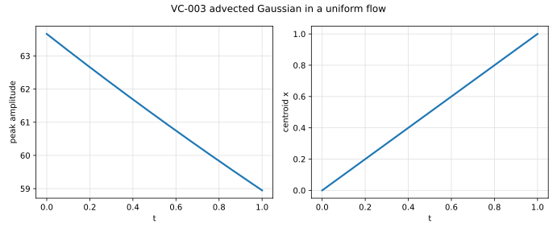

# VC-003 - Advected Gaussian in a uniform flow

## Problem

A Gaussian blob of initial variance $\sigma_0^2$ is carried by a uniform
velocity $\mathbf{U}$ across a periodic box while it diffuses.

$$
\partial_t C + \mathbf{U}\cdot\nabla C = D \nabla^2 C .
$$

$$
C(\mathbf{x},0) = \frac{1}{2\pi\sigma_0^2}
\exp\!\left(-\frac{|\mathbf{x}-\mathbf{x}_0|^2}{2\sigma_0^2}\right),
$$

periodic on all faces.

## Parameters

| Parameter | Symbol |
|---|---|
| box side | $L$ |
| initial standard deviation | $\sigma_0$ |
| velocity | $\mathbf{U}$ |
| diffusivity | $D$ |
| cell Peclet number | $\mathrm{Pe}_h = \lvert U\rvert h/D$ |

## Reference

The blob translates without change of shape and spreads exactly,

$$
C(\mathbf{x},t) = \frac{1}{2\pi\sigma^2(t)}
\exp\!\left(-\frac{|\mathbf{x}-\mathbf{x}_0-\mathbf{U}t|^2}{2\sigma^2(t)}\right),
\qquad
\sigma^2(t) = \sigma_0^2 + 2Dt ,
$$

so the peak value is $1/(2\pi\sigma^2(t))$ and the centroid is exactly
$\mathbf{x}_0 + \mathbf{U}t$. Solid-body rotation admits the same solution with
$\mathbf{U}$ replaced by the rotating field, provided the blob stays away from
the axis.

## Report

- peak amplitude against $1/(2\pi\sigma^2(t))$, as a function of
  $\mathrm{Pe}_h$,
- centroid displacement against $\mathbf{U}t$,
- $L_2$ and $L_\infty$ errors against the closed form,
- observed convergence rate.

## References

@Crank1975
