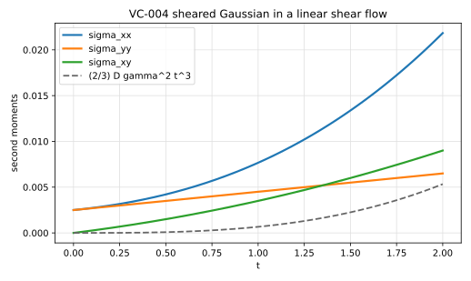

# VC-004 - Sheared Gaussian in a linear shear flow

## Purpose

Adds the one thing neither a pure-advection nor a pure-diffusion test can see:
their product. In a linear shear the three second moments of a Gaussian evolve
in closed form, and the streamwise variance acquires a term growing as $t^3$
that exists only because advection and diffusion act together. It is the
analytically exact micro-version of Taylor-Aris dispersion.

## Physical Configuration

A Gaussian blob in the linear shear $\mathbf{u} = (\dot\gamma y, 0)$, diffusing
as it is sheared.

## Governing Equations

$$
\partial_t C + \dot\gamma\, y\, \partial_x C = D \nabla^2 C .
$$

## Boundary And Initial Conditions

An isotropic Gaussian of variance $\sigma_0^2$ centred at the origin, in a
domain large enough that the blob does not reach the boundary.

## Material Parameters

| Parameter | Symbol | Value |
|---|---:|---:|
| shear rate | $\dot\gamma$ | 1 |
| initial standard deviation | $\sigma_0$ | 0.05 |
| diffusivity | $D$ | $10^{-3}$ |

## Reference Solution

The three second moments are exact,

$$
\sigma_{yy} = \sigma_0^2 + 2Dt, \qquad
\sigma_{xy} = \dot\gamma\left(\sigma_0^2 t + D t^2\right),
$$

$$
\sigma_{xx} = \sigma_0^2 + 2Dt
+ \dot\gamma^2\left(\sigma_0^2 t^2 + \tfrac{2}{3} D t^3\right).
$$

The term $\tfrac{2}{3}\dot\gamma^2 D t^3$ is the shear-dispersion signature: it
is absent at $D=0$ and absent at $\dot\gamma=0$, so it is produced only by the
coupling of the two operators.

## Recommended Numerical Setup

Compute the moments as discrete sums over the whole field, using the same
quadrature weights the solver uses elsewhere. Run long enough that the $t^3$
term is a measurable fraction of $\sigma_{xx}$ but short enough that the blob
stays inside the domain.

## Quantities To Report

- $\sigma_{xx}$, $\sigma_{yy}$, $\sigma_{xy}$ against the closed forms,
- the isolated $\tfrac{2}{3}\dot\gamma^2 D t^3$ contribution, obtained by
  subtracting the $D=0$ and $\dot\gamma=0$ results,
- observed convergence rate of each moment.

## Known Difficulties

- operator splitting that drops the cross term, which leaves the first two
  moments correct and $\sigma_{xx}$ wrong,
- a domain the sheared blob reaches before the measurement window closes,
- moments computed with a different quadrature than the solver's own.

## References

@taylor1953
@aris1956
