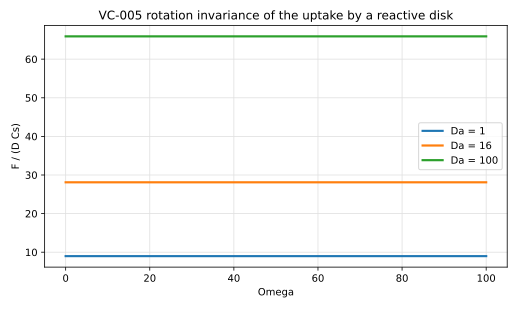
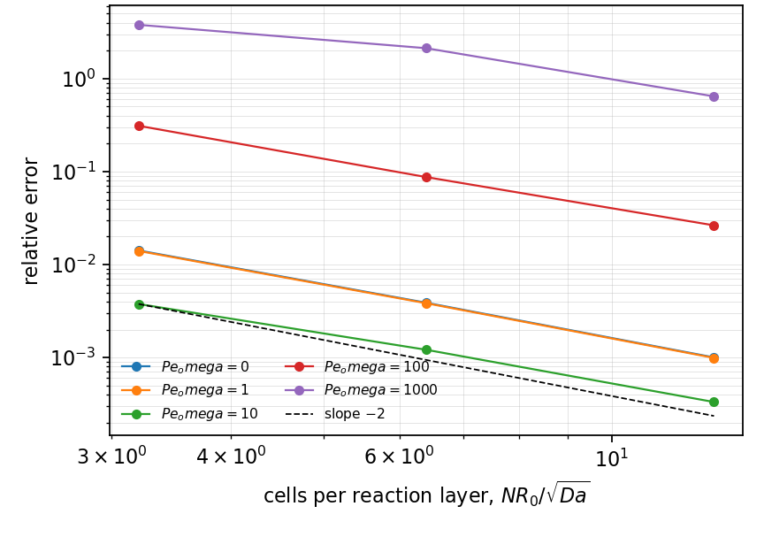
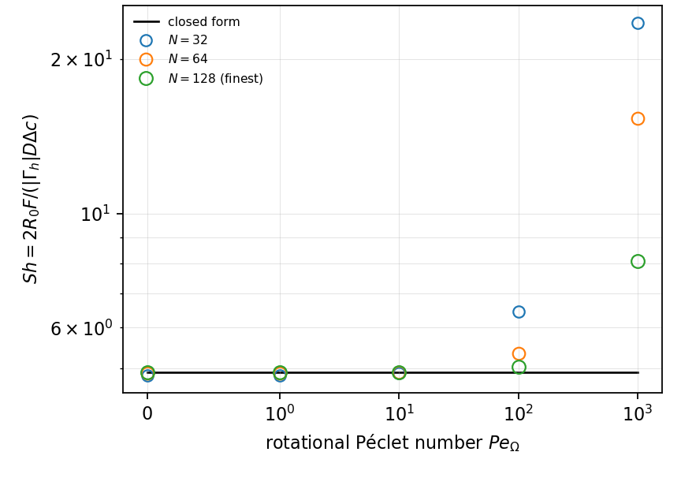

# VC-005 - Rotation invariance of the uptake by a reactive disk

## Problem

MT-002's reactive disk, with the surrounding medium in solid-body rotation
$\mathbf{u} = \Omega\,\hat{\mathbf{e}}_\theta\, r$ about the disk centre.

$$
\mathbf{u}\cdot\nabla C = D \nabla^2 C - \nu C .
$$

Because $C$ is a function of $r$ alone and $\mathbf{u}$ is purely azimuthal,
$\mathbf{u}\cdot\nabla C \equiv 0$ and the steady field is MT-002's exactly.

$$
C(R_0) = C_s, \qquad C(r\to\infty) = 0 .
$$

## Parameters

| Parameter | Symbol |
|---|---|
| disk radius | $R_0$ |
| diffusivity | $D$ |
| Damkohler number | $\mathrm{Da}$ |
| rotation rate | $\Omega$ |

## Reference

The uptake is MT-002's, unchanged by $\Omega$,

$$
F = 2\pi D C_s \sqrt{\mathrm{Da}}\,
\frac{K_1(\sqrt{\mathrm{Da}})}{K_0(\sqrt{\mathrm{Da}})} ,
$$

and the discrete divergence of the velocity field, weighted by the cell volume
fractions, must be at round-off.

## Report

- $F(\Omega)$ at each $\mathrm{Da}$, and its drift relative to $\Omega=0$,
- the volume-fraction-weighted divergence residual,
- the largest cell Peclet number at which the drift stays below a stated
  tolerance.

## Results

### Two-fluid cut-cell method - L. Libat, C. Selçuk, E. Chénier, V. Le Chenadec

Measured 2026-09-09. Uniform grid, N = 32/64/128, 16 MPI ranks. Da = 4, Pe_omega = 0, 1, 10, 100, 1000.

| Pe_omega | 0 | 1 | 10 | 100 | 1000 |
|---|---|---|---|---|---|
| N = 32 | 1.4e-2 | 1.4e-2 | 3.8e-3 | 3.1e-1 | 3.8e+0 |
| N = 64 | 3.9e-3 | 3.8e-3 | 1.2e-3 | 8.7e-2 | 2.1e+0 |
| N = 128 | 1.0e-3 | 9.9e-4 | 3.3e-4 | 2.6e-2 | 6.4e-1 |
| order | 1.95 | 1.95 | 1.87 | 1.72 | 1.72 |

The volume-fraction-weighted divergence is `0.0e+00` at every rung and every
rotation rate; the face-area-weighted one merely converges, 2.7e-1 to 5.9e-2 to
1.6e-2. That settles which discrete divergence a prescribed field has to satisfy.

**Gate not met above Pe_omega = 10.** The failure is a cell-Peclet failure of
the centred convective row, not a defect of the case: read the case as a
contamination meter against cell Peclet and gate it only where the cell Peclet
is resolved.

## References

@frankkamenetskii1969
@Crank1975
