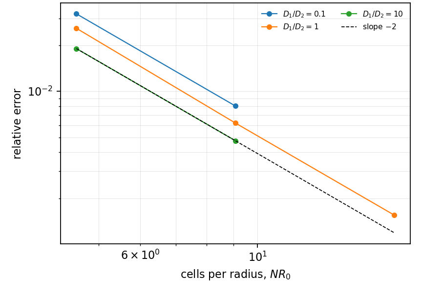
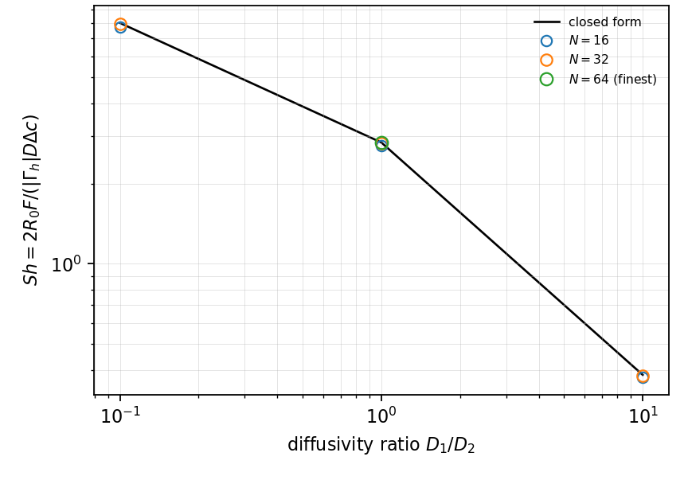

# VC-006 - Resistance additivity across a conjugate interface

## Problem

A sphere of radius $R_0$ of phase 1 with diffusivity $D_1$, in a quiescent
exterior of phase 2 with diffusivity $D_2$, coupled by a Henry partition $k$
and flux continuity. No reaction anywhere.

$$
\partial_t C_i = D_i \nabla^2 C_i, \qquad i = 1,2 .
$$

At the interface, $C_1 = k C_2$ with continuous flux. The exterior far field is
fixed, the interior starts uniform.

## Parameters

| Parameter | Symbol |
|---|---|
| sphere radius | $R_0$ |
| diffusivity ratio | $D^* = D_1/D_2$ |
| partition coefficient | $k$ |
| box size | $L$ |

## Reference

$$
\frac{1}{\mathrm{Sh}} = \frac{1}{\mathrm{Sh}_i} + \frac{k D^*}{\mathrm{Sh}_e},
$$

with all three measured from the same solve. The residual is the observable,
and its target is zero to machine precision at any Peclet number.

The identity holds only if $\mathrm{Sh}_e$ is measured, never substituted. For
a quiescent sphere in a finite box the concentric-shell value is
$\mathrm{Sh}_e = 2/(1 - R_0/R_\mathrm{out})$, and $R_\mathrm{out}$ is the
radius of the sphere of the same volume as the box,
$R_\mathrm{out} = (3/4\pi)^{1/3} L = 0.6204\,L$, not $L/2$. Substituting the
infinite-domain value $\mathrm{Sh}_e = 2$ in a box with $R_0/R_\mathrm{out}
= 0.46$ is an 84% error, not a small one.

## Report

- the additivity residual, at each $D^*$ and $k$,
- the three Sherwood numbers separately,
- measured $\mathrm{Sh}_e$ against the concentric-shell value at each box size.

## Results

### Two-fluid cut-cell method - L. Libat, C. Selçuk, E. Chénier, V. Le Chenadec

Measured 2026-09-09. Uniform grid, N = 16/32/64, 8 MPI ranks. k = 1, D* = 0.1, 1, 10.

Residual of `1/Sh - (1/Sh_i + k D* / Sh_e)`.

| D* | 0.1 | 1 | 10 |
|---|---|---|---|
| N = 16 | 0.0e+00 | 0.0e+00 | 0.0e+00 |
| N = 32 | 2.2e-16 | 0.0e+00 | 0.0e+00 |
| N = 64 | - | 0.0e+00 | - |

The measured external Sherwood number is 3.793 to 3.979 over `D*` in [0.1, 10]
and N in [16, 64], against the concentric-shell value 3.685 for this box, that
is 2.9 to 8.0% above it. The identity closes regardless, which is the point:
it closes only because `Sh_e` is measured rather than substituted.

## References

@sulaiman2019b
@froment2011
