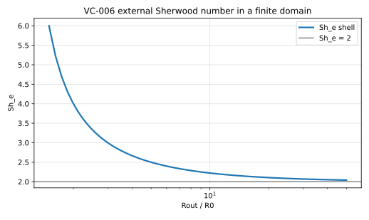

# VC-006 - Resistance additivity across a conjugate interface

## Purpose

An identity rather than a solution. The overall, internal and external transfer
coefficients of a conjugate sphere are three quantities the solver measures
independently, and at zero reaction they must satisfy a series-resistance law
exactly. It closes to machine precision when the discrete definitions of the
three Sherwood numbers are mutually consistent, and it is the strongest
available check that they are.

## Physical Configuration

A sphere of radius $R_0$ of phase 1 with diffusivity $D_1$, in a quiescent
exterior of phase 2 with diffusivity $D_2$, coupled by a Henry partition $k$
and flux continuity. No reaction anywhere.

## Governing Equations

$$
\partial_t C_i = D_i \nabla^2 C_i, \qquad i = 1,2 .
$$

## Boundary And Initial Conditions

At the interface, $C_1 = k C_2$ with continuous flux. The exterior far field is
fixed, the interior starts uniform.

## Material Parameters

| Parameter | Symbol | Value |
|---|---:|---:|
| sphere radius | $R_0$ | 1 |
| diffusivity ratio | $D^* = D_1/D_2$ | 0.1, 1, 10 |
| partition coefficient | $k$ | 0.5, 1, 2 |
| box size | $L$ | 4 to 40 |

## Reference Solution

$$
\frac{1}{\mathrm{Sh}} = \frac{1}{\mathrm{Sh}_i} + \frac{k D^*}{\mathrm{Sh}_e},
$$

with all three measured from the same solve. The residual is the observable,
and its target is zero to machine precision at any Peclet number.

The identity holds only if $\mathrm{Sh}_e$ is measured, never substituted. For
a quiescent sphere in a finite box the concentric-shell value is
$\mathrm{Sh}_e = 2/(1 - R_0/R_\mathrm{out})$, and $R_\mathrm{out}$ is the
radius of the sphere of the same volume as the box,
$R_\mathrm{out} = (3/4\pi)^{1/3} L = 0.6204\,L$, not $L/2$. Substituting the
infinite-domain value $\mathrm{Sh}_e = 2$ in a box with $R_0/R_\mathrm{out}
= 0.46$ is an 84% error, not a small one.

## Recommended Numerical Setup

Report the residual at several box sizes together with the measured
$\mathrm{Sh}_e$, so that the identity is seen to close independently of how far
the external value sits from 2.

## Quantities To Report

- the additivity residual, at each $D^*$ and $k$,
- the three Sherwood numbers separately,
- measured $\mathrm{Sh}_e$ against the concentric-shell value at each box size.

## Known Difficulties

- substituting $\mathrm{Sh}_e = 2$ instead of measuring it,
- taking $R_\mathrm{out} = L/2$ for a cubic box,
- Sherwood numbers defined on different reference concentrations, which breaks
  the identity while each is individually plausible.

## References

@sulaiman2019b
@froment2011
