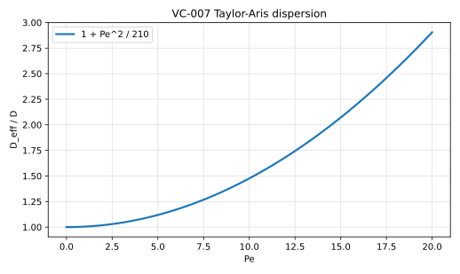
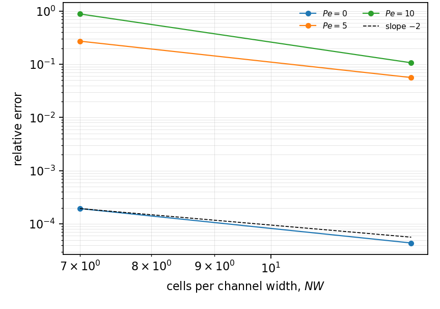
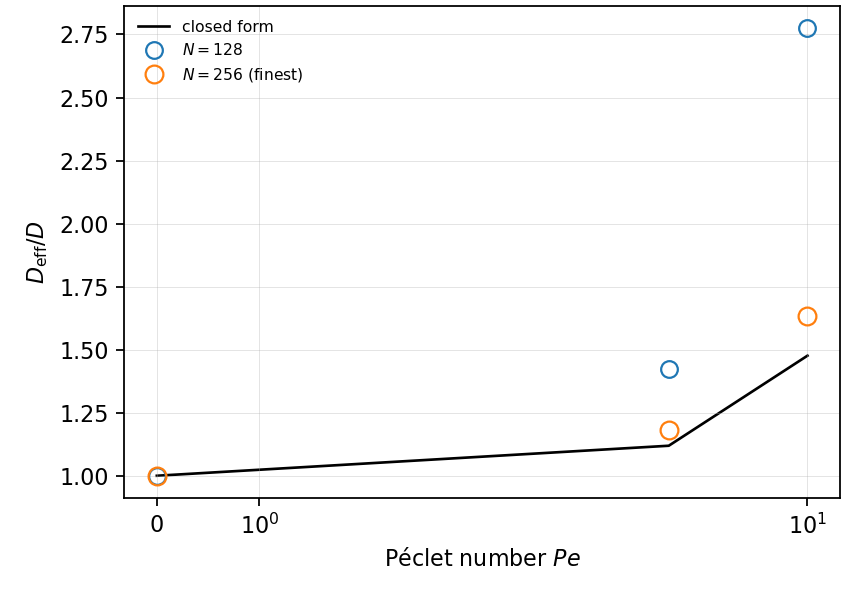

# VC-007 - Taylor-Aris dispersion in a plane channel

## Problem

Plane Poiseuille flow between impermeable walls, periodic in $x$, carrying a
cosine mode in the axial direction.

$$
\partial_t C + u(y)\,\partial_x C = D\nabla^2 C,
\qquad
u(y) = \frac{3}{2}\bar{u}\left(1 - \left(\frac{2y}{W}\right)^2\right) ,
$$

with $\partial_y C = 0$ at both walls and $C(x, y, 0) = \cos(kx)$.

## Parameters

| Parameter | Symbol |
|---|---|
| channel width | $W$ |
| mean velocity | $\bar{u}$ |
| diffusivity | $D$ |
| axial wavenumber | $k$ |
| Peclet number | $\mathrm{Pe} = \bar{u}W/D$ |

## Reference

Once the cross-channel profile has relaxed, the mode decays at $D_\mathrm{eff}
k^2$ with

$$
\frac{D_\mathrm{eff}}{D} = 1 + \frac{\mathrm{Pe}^2}{210}
$$

for plane Poiseuille flow. At $\mathrm{Pe} = 0$ this is exact at any time: pure
diffusion decays at $Dk^2$.

Measuring the coefficient from the decay of a mode rather than from the
variance of a pulse is what makes the case affordable. Taylor-Aris needs
$t \gg W^2/D$, and by then a pulse is many channel widths long, so the domain
must be long against the spreading and the spreading resolved across the
channel, and the two demands multiply. A decay rate needs neither.

## Report

- the decay rate at $\mathrm{Pe} = 0$ against $Dk^2$, on error,
- $D_\mathrm{eff}/D$ at finite $\mathrm{Pe}$, on observed order rather than on
  error: an asymptotic coefficient measured across a handful of cells has a
  residual that is resolution, and what says the scheme converges to Taylor's
  number is the rate at which it does,
- the time step actually used, which is bound by the CFL condition and not by
  accuracy.

## Results

### Two-fluid cut-cell method - L. Libat, C. Selçuk, E. Chénier, V. Le Chenadec

Measured 2026-09-10. Uniform grid, 16 MPI ranks, two rungs at 7 and 13 cells
across the channel, Crank-Nicolson with two backward-Euler half steps at the
start.

| Pe | 0 | 5 | 10 |
|---|---|---|---|
| rel. error, 7 cells | 1.9e-4 | 2.7e-1 | 8.8e-1 |
| rel. error, 13 cells | 4.4e-5 | 5.6e-2 | 1.1e-1 |
| order | 2.15 | 2.27 | 3.05 |

The $\mathrm{Pe} = 0$ row is gated on error and meets it. The sheared rows are
gated on order and both exceed two; their errors are large because thirteen
cells across the channel is a coarse place to read an asymptotic coefficient. A
third rung at 25 cells would put them near a percent, and the case declines
that rung by name rather than grinding at it.

Being periodic in $x$, this is the one channel case whose interface has no end
points, so it separates the corner treatment from everything else the family
measures.

## References

@taylor1953
@aris1956
@sankarasubramanian1973
